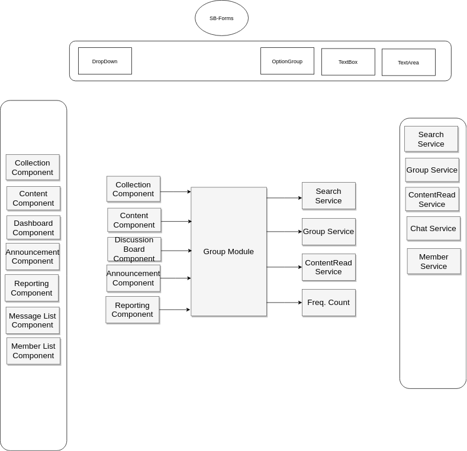

# Groups

**Business context:**

A logged in user should be able to see groups created by him/her + groups in which s/he is a member

**As a logged in user, I should be able to view all my groups, So that I can perform various actions within the group**

**Acceptance criteria:**

Pre-conditions:

Logged in user has clicked the option to view all groups

Verify that:

1. User is able to view all groups where s/he is admin (group can be created by him/her or assigned to him/her )
2. User is able to view all groups in which s/he is a member
3. A group has a special indication if s/he is the Admin of that group (group creator or assigned as admin)
4. All the groups where s/he is an admin is shown first, followed by groups that s/he is part of
5. Groups are ordered by creation date - recent to last (within admin & non-admin sections)
6. User sees an option to create a group



Form Configs Associated:

####

Master Component List Following are the list of components required to be re-used across Mobile & Portal :

Please refer to following link for CC

[https://github.com/Sunbird-Ed/SunbirdEd-consumption-ngcomponents/](https://github.com/Sunbird-Ed/SunbirdEd-consumption-ngcomponents/)

| **Component**     | **Component Invocation**                                                                                       | **Component - Type** |
| ----------------- | -------------------------------------------------------------------------------------------------------------- | -------------------- |
| Course            | \<sb-course-card \[content]=\{{?\}} (cardClick)="cardClick($event)" (menuClick)="cardMenuClick($event)">       | Card                 |
| Announcement      | \<sb-announcement-card \[content]=\{{?\}} (cardClick)="cardClick($event)" (menuClick)="cardMenuClick($event)"> | View Only-Card       |
| Chat              | \<sb-chat-room \[chatRoomId]=\{{?\}}>                                                                          | Module               |
| Discussion Board  |                                                                                                                | Module               |
| Text Book         | \<sb-library-card \[content]=\{{?\}} (cardClick)="cardClick($event)" (menuClick)="cardMenuClick($event)">      | Card                 |
| Content           | \<sb-content-card \[content]=\{{?\}} (cardClick)="cardClick($event)" (menuClick)="cardMenuClick($event)">      | Card                 |
| Collection        | \<sb-collection-card \[content]=\{{?\}} (cardClick)="cardClick($event)" (menuClick)="cardMenuClick($event)">   | Card                 |
| CardGrid (Portal) | \<sb-cards-grid \[contents]=\{{?\}} cardType=”Library                                                          | Course               |

#### Activity Creation Form Config (Against Version)

Any Form Configs associated with the config will completely gets driven by backend metdata to associate forms. There is a generic Abstracted Library being built called as SB-forms. Please refer the link below:

| **Type**               | **Config**                                                                   |
| ---------------------- | ---------------------------------------------------------------------------- |
| AnnouncementCreate     | {formName:””,fields:\[{TextBox},{TextArea},{CheckBox},{Submit}]}             |
| ChatCreate             | {formName:””,fields:\[{TextBox},{TextArea},{CheckBox},{Submit}]}             |
| Discussion BoardCreate | {formName:””,fields:\[formName:””,{TextBox},{TextArea},{CheckBox},{Submit}]} |
| ….                     |                                                                              |

###

Element Config\
Drop Down Config

```actionscript3
{
  "code": "category",
  "type": "select",
  "default": "loginRegistraction",
  "templateOptions": {
    "placeHolder": "Select Category",
    "multiple": false,
    "hidden": true,
    "dataSource": DATASOURCETYPE.LOCAL || DATASOURCE.CLOSURE || DATASOURCE.API
    "options": CLOSURE || INDEPENDENT SERVICE CALL || [
      {
        "value": "content",
        "label": "Content"
      },
      {
        "value": "loginRegistraction",
        "label": "Login/Registration"
      },
      {
        "value": "teacherTraining",
        "label": "Teacher Training"
      },
      {
        "value": "otherissues",
        "label": "Other Issues"
      }
    ]
  }
}
```

TextBox Config

```actionscript3
{
      code: "declared-school-name",
      type: FieldConfigInputType.INPUT,
      defaultValue: 'hello Defalut value',
      templateOptions: {
        label: 'Sample Input',
        placeHolder: "ENTER_SCHOOL_NAME"
      }
    },
```

### Back End Design

GroupCassandra

```js
{
  "id": uuid, // PARTITION key
  "name": human_friendly_name, // need not be unique [Indexed]
  "activities": "[{
         "activity_id":  "activityId" //Extra Added.
  }]", // MAP [NO index created. No need to query specific] 
  "createdBy": uuid,
  "groupActivities":[], //Extra Added
  "createdOn": timestamp,
  "updatedBy": uuid,
  "updatedOn": timestamp,
  "status": "active", "inactive",
  "joinStrategy": InvitationOnly, Moderation - TBD
}
PRIMARY_KEY(id, name)
```

Groups can be deleted only by the creator, not by the admin.

ElasticSearch Solution 1:

The idea is to try eliminate ES. We will start doing reads directly from primary database.

activities is expanded as map. All other details flow to ES.

Solution 2:

Have a separate table meant to have multiple information sourced with a content.

Activity\_DataCassandra

```js
{
  "id": activity_id/plugin_id, 
  "activityInstanceId" : "do_id1",
  "type": "Course"
  "validity" : 
  "data": {
               "name": "The big bang theory",
               "orgName": ""
               
          // Extra Meta} // Not indexed, just serves as a placeholder to store any runtime data.
}
PRIMARY_KEY(id, activityInstanceId)
```

Group\_MemberCassandra

```js
{
  "id": group_uuid, // PARTITION key
  "memberId": userId // This is not an array, because we need to capture information who added, when added etc
  "role": [
      "isAdmin", "isMember", "// We can add moderator"
  ],
  "addedBy": uuid,
  "addedOn": timestamp,
  "removedBy": uuid,
  "removedOn": timestamp,
  "updatedBy": uuid,
  "updatedOn": timestamp
}
PRIMARY_KEY(id, role, memberId)
```

Plugin RegistryCassandra

```js
{
    "id": plugin_instance_id, // PARTITION key
    "ver": "1.0",
    "isActive": boolean,
    "shortId": "org.ekstep.launcher",
    "author": "string", // Default to "Sunbird"
    "description": "",
    "publishedDate": "",
    "data": { 
    } 
}
PRIMARY_KEY(id, author, isActive)
```

#### API

Groups

|                                                                                                                                                                                                                   |            |   |
| ----------------------------------------------------------------------------------------------------------------------------------------------------------------------------------------------------------------- | ---------- | - |
| GroupListing Against a User                                                                                                                                                                                       | 1 API read |   |
| Members against a Group                                                                                                                                                                                           | 1 API read |   |
| Activities Listing                                                                                                                                                                                                | 1 API read |   |
| Create a Group                                                                                                                                                                                                    |            |   |
| Update a Group a) Add member to a group b) Add Activities to a group c) Attaching Activity to a group d) Make Member Admin of a Group e) Soft Delete of Member of a Group f) Disable/Delete Activity from a Group |            |   |
| Delete the Group (Mostly Soft Delete)                                                                                                                                                                             |            |   |
| Group                                                                                                                                                                                                             |            |   |

### Discussion Points

| **Discussion Points**                                                                                                                       |   |
| ------------------------------------------------------------------------------------------------------------------------------------------- | - |
| User Course should be changed to User Group Course.                                                                                         |   |
| Enable All API on Course Consumption to be Group Context Driven a) Join Course b) CourseStateRead c) CourseStateUpdate d) CourseAggregation |   |
| Enabling Feature Selection Based on Groups                                                                                                  |   |
| Metadata Storage Against a Group in same table vs different table                                                                           |   |

***

\[\[category.storage-team]] \[\[category.confluence]]
