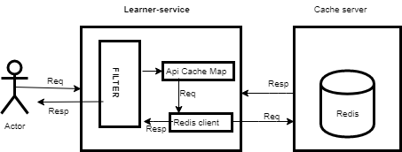

# Cache-Implementation-Design

**Overview :**

\*\*                  \*\* Cache is an important aspect of an application to improve the api response time. For any heavily used system we need to have a mechanism to cache some of the data , which is not going to change very frequently.&#x20;

&#x20; As of now Sunbird won't have any  Caching mechanism on server side. So we are trying to bring caching implementation in Sunbird.  This Document will describe following sections.

&#x20; 1\.  Different ways to do caching

&#x20; 2\. What are the things need to be cache?

&#x20; 3\. what should be ttl?

&#x20; 4\. Cache implementation Design

## Different Caching implementation

\*\* a.\*\*   **In memory cache**   **:**

&#x20;       **Pros** :&#x20;

&#x20;          1\. Data lookup is faster because it's store  in same server in memory.

&#x20;          2\. No serialisation / deserialisation overhead

&#x20;      **Cons** : &#x20;

&#x20;           1\.  in case of multiple instance data inconsistency will occurs.

&#x20;           2\.  Server memory usages will be high

&#x20;           3\. Scaling will be problem due to in memory cache.&#x20;

\*\* b.\*\* \*\*Distributed Cache : \*\*

\*\* \*\*     **Pros** :    &#x20;

&#x20;           1\. Easy to scale

&#x20;           2\. No data  inconsistency

&#x20;    **Cons** :

&#x20;          1\. Single point of failure

&#x20;           2\. some latency for data read. &#x20;

## What need to be cache:

&#x20;We need to cache following api responses&#x20;

&#x20;            1\. get roles

&#x20;            2\. get MediaTypes (Social media link)

&#x20;            3\. get Org Type

&#x20;            4\.  page Assemble

&#x20;             5\. Org Creation report

&#x20;             6\. Org Consumption report

&#x20;             7\. User creation report

&#x20;             8\. User consumption report

&#x20;             9\. Course consumption report

&#x20;             10\. Skills list

&#x20;             We can add some other user specific api for caching.

&#x20;   \* TTL can be define based on data changes policy. if Data is going to change once in a while then ttl can be more.

&#x20;  &#x20;

## Implementation design with Redis:&#x20;

## &#x20;  

\*\*WorkFlow: \*\*

\*\*               \*\* Every request will be received by learner service filter, then filter will verify uri inside Api cache Map. This map will contains all those uri that need to be cached.

&#x20;               **Case 1:** Uri found inside map then with help of redis client it will make call to redis server.

&#x20;                       **Case 1.1 :**   If data found in cache then it will be served from here it self.

&#x20;                       \*\*case 1.2 :  \*\* If data not found then response will be served from server and same will be saved in cache as well.

&#x20;             \*\*  Case 2 :  \*\* Uri not found inside map then normal flow will work.

Notes:&#x20;

&#x20; 1 .Some of the master data will be loaded during server startup.

&#x20;           Example : Role read, Page section cache,  OrgType , MediType, Skill Lists.

&#x20; 2\.  Update will happen on Cache data as well .      &#x20;

public interface DataCache {

&#x20; public boolean saveData(String identifier, String value,long ttl);

&#x20;public String readData (String identifier);

&#x20;public boolean  update (String identifier, String value,long ttl);

public  boolean dataFlush();

&#x20;}

public Class RedisDataCacheImpl implements DataCache   {

}

## Different caching framework.

&#x20;1\. Redis   2. EhCache  3. MemCache  4. HazelCast

&#x20; \*\*Redis : \*\*   Redis Read and write performance is more than EhCache , MemCache and HazelCast.

\*\*     Pros : \*\*

\*\*                  \*\* 1. Supported multiple data type storage

&#x20;                 2\. Replication (Master salve) or (Master master) possible

&#x20;                 3\.  Data Consistency and durability

&#x20;                 4\. In-memeory support too

&#x20;                 5\.  Support for pub sub model.

&#x20;     \*\*Cons : \*\*

&#x20;              1\.  Single threaded.

&#x20;      &#x20;

Apart from that server can set Cache-control , Etag  header to do the cache from caller side as well.&#x20;

## Approach to generate the key:

&#x20;There are different approach to generate keys.

&#x20;  1\. Store key as normal String&#x20;

&#x20;           Example: &#x20;

&#x20;                  GET  /v1/user/read/{userId}?keys=missingFields,profileCompleteness

&#x20;                     **Key can be  :**

&#x20;                             a.  "/v1/user/read/{userId}" &#x20;

&#x20;                             b.  "/v1/user/read/{userId}?keys=missingFields,profileCompleteness"

&#x20;                             c :  {"/v1/user/read/{userId}" :{"keys=missingFields,profileCompleteness":""} }

&#x20;                             d : Do the hash of complete key

&#x20;                 POST/PUT/PATCH   /data/page/assember

&#x20;                                    "request":{

&#x20;                                                    "source":"web",

&#x20;                                                     "name":"Explore\_test",

&#x20;                                                  "filters":{

&#x20;                                                            }

&#x20;                                                    }

&#x20;                 \*\* Key can be : \*\*

&#x20;                                    HashOf  (URI+RequestBody):

Note:&#x20;

&#x20;  1\. Need to think about data privacy.&#x20;

&#x20;  2\. Key generation need to be explore more.

&#x20;                         &#x20;

&#x20;                  &#x20;

&#x20;                          &#x20;

***

\[\[category.storage-team]] \[\[category.confluence]]
