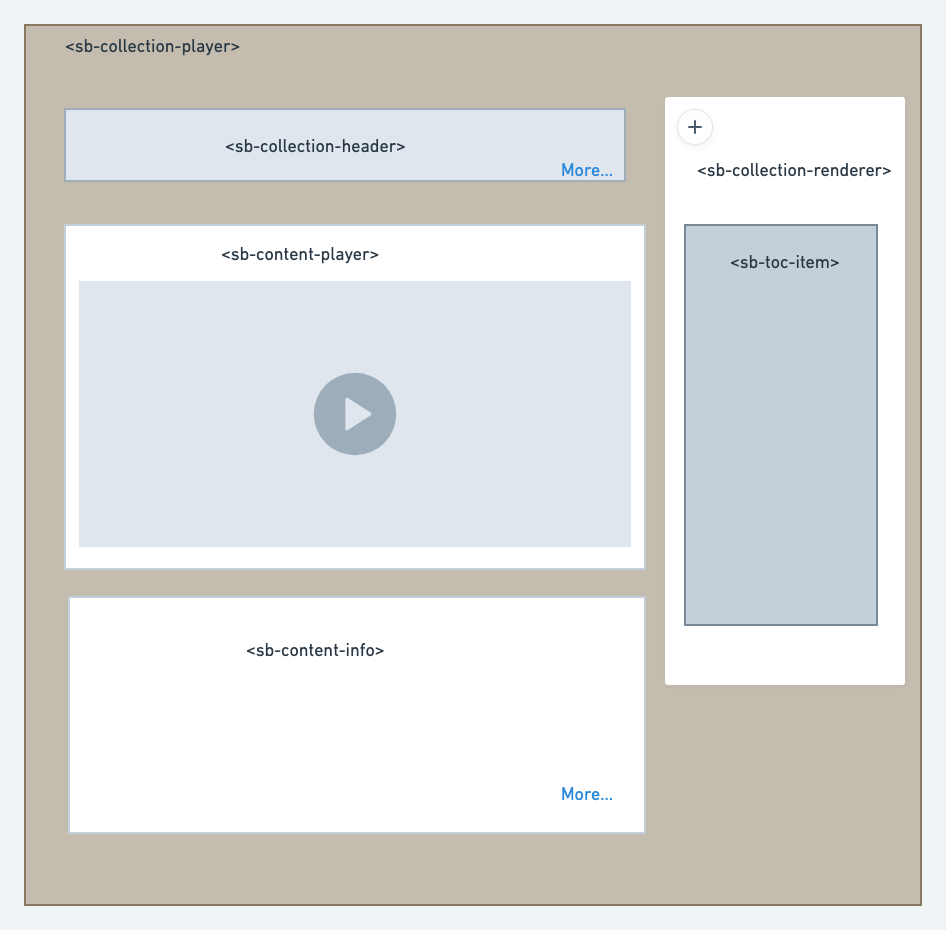

# Problem statement

For the adaptors to experience the collections which are part of knowLG building block there is a need to build a player which will render them, So there is a need to build a collection player which supports all types of collections.

Since the knowLG portal is built using the angular framework we will design the player as a component and each is responsible for taking the input data and rendering and also providing the output event for the same.

Design

Below provides the interfaces for each component that needs to be implemented

< **sb-collection-player** \[collection]=””>

< **sb-collection-header**

\[name]=””

\[metadata]=”<\['string': ‘’]>” />

< **sb-collection-renderer**

\[hierarchy]=”collection-hierarchy”

(selectedContent)=”renderContent($event)” />

< **sb-toc-item** ….> - This should be used from the common consumption components which renders the hierarchy.

< **sb-content-info** \[content]=”content”>

< **sb-collection-info** \[collection]=””>

***

\[\[category.storage-team]] \[\[category.confluence]]
