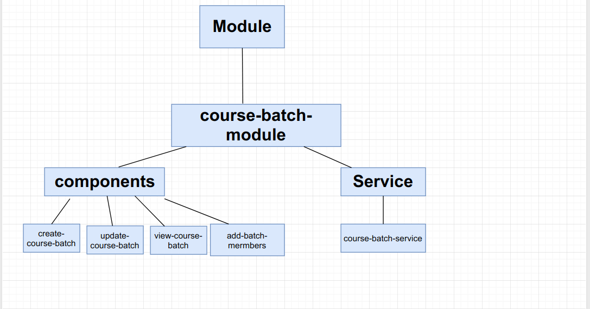

# Courses-mentors-should-be-able-to-administer-closed-(invite-only)-batches-across-Orgs-within-a-tenan

#### **Background:**

Courses mentors should be able to administer closed (invite-only) batches across Orgs within a tenant.

#### Problem Statement:

The Content creator organisation should be able to invite the members of the partner organisations to take the course.

#### Proposed Solution:

Batch creation template have to redesigned to handle search and discovery of participants from a huge pool.

In the proposed new design, batch creation is simplified by logically breaking it into two parts - the first part captures the basic details of the batch and the second part deals with adding/removing mentors/participants.

**Implementation:**

**Module structure:**

**Module:**

we will go with new module name of module is course-batch-module

create batch flow:

**component:**

1.create-course-batch

2.add-course-batch-members

3.view-course-batch

4.update-course-batch

**Validation:**

To validate the form we will use reactive form.in case of ongoing batch mandatory filed should not be cleared.

**To adding/removing mentors/participants:**

1. This will be child component which we will use in create component and update component.
2.  There will be two steps in first steps after filling mandatory feild

    on click of add members button we will call the add-members component

    and this time step will be add-members.

&#x20;     3.With rootOrgId using org/search API we will get org,and suborg.

&#x20;     4.On selection of suborg to get the participants and mentors

&#x20;           Make an api call to user/v1/search .

&#x20;           example:

&#x20;               API URL: user/v1/search

&#x20;            Request Payload:

&#x20;           {"request":{"filters":{"id":"ORG\_001"},"query":""\}}

&#x20;    5\. after adding mentors it will show to the right side of table as per design and it will remove from mentors drop down same for the participants.

&#x20;    6\.  we can delete the mentors also when we will remove mentors it will again come to mentors drop down lists same for the participants.

&#x20;    7\. To search the mentors  we will implement a search filter that will search based in name of mentors and it will be local search.

&#x20;    8\. In mentors list in action column we will show only edit icon as per the discussion .(need to clearify).

&#x20;    9\. on click of create batch button we will make an API call to create a batch.

&#x20;    10\. When course\_mentor is on rootOrglevel then rootOrg Drop down input will show with rootOrgName as read only and in sub\_org drop down root\_org will also show .

**Update Batch:**

Edit batch detail > This permission will ensure that the course mentor can edit the batch details per the following matrix:

**if batch is expired :**

Name of batch :No

About the batch:No

Start date:No

End date: No

Add/Remove Mentors & Participants: No

**if batch is Ongoing :**

Name of batch :No

About the batch:Yes

Start date:No

End date: Yes

Add/Remove Mentors & Participants : Yes

**if batch is Upcoming :**

Name of batch :Yes

About the batch:Yes

Start date:Yes

End date: Yes

Add/Remove Mentors & Participants : Yes

***

\[\[category.storage-team]] \[\[category.confluence]]
