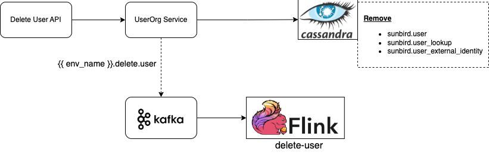

# \[Design]-Delete-Account-Functionality

### Introduction

This wiki explains the design for delete user account feature. As of now there is no hard delete of user profile flow available in Sunbird. At present, we have functionality to BLOCK/UNBLOCK users.

### Background & Problem Statement

Sunbird supports the mobile app for Android and iOS. As per the latest policy update of the Apple App Store and Google Play Store, mandates the user deletion from the app, if the app is having the signup from app. The specific policy mandates can be found using the following links:

* Apple App Store Policy - [https://developer.apple.com/app-store/review/guidelines/#data-collection-and-storage](https://developer.apple.com/app-store/review/guidelines/#data-collection-and-storage)
* Apple App Store Policy - [https://developer.apple.com/support/offering-account-deletion-in-your-app](https://developer.apple.com/support/offering-account-deletion-in-your-app)
* Google Play Store Policy - [https://support.google.com/googleplay/android-developer/answer/13327111?hl=en](https://support.google.com/googleplay/android-developer/answer/13327111?hl=en)

Registered users must have access to a "Delete Account" option on both the app and the portal. This option will allow them to initiate the account deletion process themselves.

#### Key Design Problems

User should not able to do the following things after successful deletion of account:

* User should not be able to login by using the existing login credentials post account deletion.
* Any of the Personally Identifiable Information (PII) of the user, such as name, email, and phone number should not be available in any DB in any format (even encrypted format).
* Other than PII data should not be deleted. User transactional data and user created contents ( _usage,_ _rating etc_ ) are to be retained.
* Certificates issued to the deleted users should not be accessible, but should be verifiable. (Storing only the name of the user in Sunbird RC to display in certificate).
* External id of the SSO user should be removed.
* List the deleted user list to admin dashboard.
* Deleted user’s asset should be transferred to the other user after successful deletion.

### Design

#### Delete User



* Send the OTP to the user’s email/phone to validate the user. (OTP templates for user account deletion verification)

Sync

* Delete login credentials and sessions from Keycloak.
* Update the sunbird.user table. Set the following fields as empty: (redis data for the following fields will become empty for that user)
  * firstName
  * lastName
  * email
  * dob
  * phone
  * maskedEmail
  * maskedPhone
  * prevUsedEmail
  * prevUsedPhone
  * recoveryEmail
  * recoveryPhone
* Update the status from **ACTIVE** to **DELETED** .
* Remove the user entry from sunbird.user\_lookup table.
* Remove the SSO user entry from sunbird.user\_external\_identity .
* Send the AUDIT telemetry event after successful/failure update/deletion of the above tables.
* Trigger the delete user kafka event \{{env\_name\}}.delete.user

User Deletion Flink Job

* Verify the sync steps is successfully completed else perform the pending actions.
* Update the user entry in sunbird.user\_organisation (async) - May not be required.
  * isdeleted - True
  * orgleftdate - system date
* Update the user’s name in nodeBB as **Deleted User** to display in discussion forum.
* Group - TBD
* Send the AUDIT telemetry event after successful/failure update/deletion of the above tables.

User delete API:DELETE '\{{host\}}/api/user/v1/delete/\{{userId\}}'

```
curl --location --request DELETE '{{host}}/api/user/v1/delete/{{userId}}' \
--header 'Content-Type: application/json' \
--header 'Authorization: Bearer {{api_key}}' \
--header 'x-authenticated-user-token: {{user_token}}'
```

Response

```
{
    "id": "api.user.delete",
    "ver": "1.0",
    "ts": "2023-08-28T13:54:45Z+05:30",
    "params": {
        "resmsgid": "a638c46e-63a5-47de-bf00-029cbe435e5e",
        "msgid": null,
        "err": null,
        "status": "successful",
        "errmsg": null
    },
    "responseCode": "OK",
    "result": {
        "response": "SUCCESS",
        "userId": "{{userId}}"
    }
}
```

Delete User Kafka Event

| **Property**    | **Description**                                                                                                      |
| --------------- | -------------------------------------------------------------------------------------------------------------------- |
| organisationId  | It helps to identify user belongs to which organisation                                                              |
| userId          | Deleted user id                                                                                                      |
| suggested\_user | If user have role other than PUBLIC, than suggested user list can be send in the event for each role user is having. |

Sample event

```
{
  "eid": "BE_JOB_REQUEST",
  "ets": 1619527882745,
  "mid": "LP.1619527882745.32dc378a-430f-49f6-83b5-bd73b767ad36",
  "actor": {
    "id": "delete-user",
    "type": "System"
  },
  "context": {
    "pdata": {
      "id": "org.sunbird.platform",
      "ver": "1.0"
    }
  },
  "object": {
    "id": "<deleted-userId>",
    "type": "User"
  },
  "edata": {
    "organisationId": "<organisationId>"
    "userId": "<deleted-userId>",
    "suggested_users": [
    	{
    		"role": "ORG_ADMIN",
    		"users": ["<orgAdminUserId>"]
    	},
    	{
    		"role": "CONTENT_CREATOR",
    		"users": ["<contentCreatorUserId>"]
    	},
    	{
    		"role": "COURSE_MENTOR",
    		"users": ["<courseMentorUserId>"]
    	}
    ],
    "action": "delete-user",
    "iteration": 1
  }
}
```

#### Deleted Users search curl

User search API can be used to get the more detail about user. e.g. name.

Curlcurl --location '\{{host\}}/api/user/v3/search' \\

\--header 'Authorization: \{{kong\_api\_key\}}' \\

\--header 'X-Authenticated-User-token: \{{keycloak\_access\_token\}}' \\

\--header 'Content-Type: application/json' \\

\--data '{

```
"request": {

    "filters": {

       "status": 2,
      "updatedDate": {">=": "2023-05-10 08:41:50:752+0000"}     

    }

}
```

}'

**OTP Template** Email Template

|                                                                                                                                                                                                                                                                                                                                                                                                                                                                                                                                                                                                                                                                                                                                                                                                                                                                                                                                                                                                                                                                                          | <table data-header-hidden><thead><tr><th></th></tr></thead><tbody><tr><td><table data-header-hidden><thead><tr><th></th></tr></thead><tbody><tr><td><table data-header-hidden><thead><tr><th></th></tr></thead><tbody><tr><td><p>Hello User,<br></p><p>To confirm the deletion of your $installationName account, please enter the following OTP: $otp.</p><p>This OTP is valid for the next $otpExpiryInMinutes.</p><p>If you did not request this account deletion, please ignore this message or contact our support team immediately at $supportEmail.</p><p>Thank you for using $installationName.</p><p>Best regards,<br>The $installationName Team</p></td></tr></tbody></table></td></tr><tr><td><p>Hello User,<br></p><p>To confirm the deletion of your $installationName account, please enter the following OTP: $otp.</p><p>This OTP is valid for the next $otpExpiryInMinutes.</p><p>If you did not request this account deletion, please ignore this message or contact our support team immediately at $supportEmail.</p><p>Thank you for using $installationName.</p><p>Best regards,<br>The $installationName Team</p></td></tr></tbody></table></td></tr><tr><td><table data-header-hidden><thead><tr><th></th></tr></thead><tbody><tr><td><p>Hello User,<br></p><p>To confirm the deletion of your $installationName account, please enter the following OTP: $otp.</p><p>This OTP is valid for the next $otpExpiryInMinutes.</p><p>If you did not request this account deletion, please ignore this message or contact our support team immediately at $supportEmail.</p><p>Thank you for using $installationName.</p><p>Best regards,<br>The $installationName Team</p></td></tr></tbody></table></td></tr><tr><td><p>Hello User,<br></p><p>To confirm the deletion of your $installationName account, please enter the following OTP: $otp.</p><p>This OTP is valid for the next $otpExpiryInMinutes.</p><p>If you did not request this account deletion, please ignore this message or contact our support team immediately at $supportEmail.</p><p>Thank you for using $installationName.</p><p>Best regards,<br>The $installationName Team</p></td></tr></tbody></table> |   |
| ---------------------------------------------------------------------------------------------------------------------------------------------------------------------------------------------------------------------------------------------------------------------------------------------------------------------------------------------------------------------------------------------------------------------------------------------------------------------------------------------------------------------------------------------------------------------------------------------------------------------------------------------------------------------------------------------------------------------------------------------------------------------------------------------------------------------------------------------------------------------------------------------------------------------------------------------------------------------------------------------------------------------------------------------------------------------------------------- | -------------------------------------------------------------------------------------------------------------------------------------------------------------------------------------------------------------------------------------------------------------------------------------------------------------------------------------------------------------------------------------------------------------------------------------------------------------------------------------------------------------------------------------------------------------------------------------------------------------------------------------------------------------------------------------------------------------------------------------------------------------------------------------------------------------------------------------------------------------------------------------------------------------------------------------------------------------------------------------------------------------------------------------------------------------------------------------------------------------------------------------------------------------------------------------------------------------------------------------------------------------------------------------------------------------------------------------------------------------------------------------------------------------------------------------------------------------------------------------------------------------------------------------------------------------------------------------------------------------------------------------------------------------------------------------------------------------------------------------------------------------------------------------------------------------------------------------------------------------------------------------------------------------------------------------------------------------------------------------------------------------------------------------------------------------------------------------------------------------------------------------------------------------------------------------------------- | - |
| <table data-header-hidden><thead><tr><th></th></tr></thead><tbody><tr><td><table data-header-hidden><thead><tr><th></th></tr></thead><tbody><tr><td><p>Hello User,<br></p><p>To confirm the deletion of your $installationName account, please enter the following OTP: $otp.</p><p>This OTP is valid for the next $otpExpiryInMinutes.</p><p>If you did not request this account deletion, please ignore this message or contact our support team immediately at $supportEmail.</p><p>Thank you for using $installationName.</p><p>Best regards,<br>The $installationName Team</p></td></tr></tbody></table></td></tr><tr><td><p>Hello User,<br></p><p>To confirm the deletion of your $installationName account, please enter the following OTP: $otp.</p><p>This OTP is valid for the next $otpExpiryInMinutes.</p><p>If you did not request this account deletion, please ignore this message or contact our support team immediately at $supportEmail.</p><p>Thank you for using $installationName.</p><p>Best regards,<br>The $installationName Team</p></td></tr></tbody></table> |                                                                                                                                                                                                                                                                                                                                                                                                                                                                                                                                                                                                                                                                                                                                                                                                                                                                                                                                                                                                                                                                                                                                                                                                                                                                                                                                                                                                                                                                                                                                                                                                                                                                                                                                                                                                                                                                                                                                                                                                                                                                                                                                                                                                    |   |
| <table data-header-hidden><thead><tr><th></th></tr></thead><tbody><tr><td><p>Hello User,<br></p><p>To confirm the deletion of your $installationName account, please enter the following OTP: $otp.</p><p>This OTP is valid for the next $otpExpiryInMinutes.</p><p>If you did not request this account deletion, please ignore this message or contact our support team immediately at $supportEmail.</p><p>Thank you for using $installationName.</p><p>Best regards,<br>The $installationName Team</p></td></tr></tbody></table>                                                                                                                                                                                                                                                                                                                                                                                                                                                                                                                                                      |                                                                                                                                                                                                                                                                                                                                                                                                                                                                                                                                                                                                                                                                                                                                                                                                                                                                                                                                                                                                                                                                                                                                                                                                                                                                                                                                                                                                                                                                                                                                                                                                                                                                                                                                                                                                                                                                                                                                                                                                                                                                                                                                                                                                    |   |
| <p>Hello User,<br></p><p>To confirm the deletion of your $installationName account, please enter the following OTP: $otp.</p><p>This OTP is valid for the next $otpExpiryInMinutes.</p><p>If you did not request this account deletion, please ignore this message or contact our support team immediately at $supportEmail.</p><p>Thank you for using $installationName.</p><p>Best regards,<br>The $installationName Team</p>                                                                                                                                                                                                                                                                                                                                                                                                                                                                                                                                                                                                                                                          |                                                                                                                                                                                                                                                                                                                                                                                                                                                                                                                                                                                                                                                                                                                                                                                                                                                                                                                                                                                                                                                                                                                                                                                                                                                                                                                                                                                                                                                                                                                                                                                                                                                                                                                                                                                                                                                                                                                                                                                                                                                                                                                                                                                                    |   |

```
Hello User,

To confirm the deletion of your Sunbird Ed account, please enter the following OTP: [OTP Code].

This OTP is valid for the next [Time Limit, e.g., 5 minutes]. 

If you did not request this account deletion, please ignore this message or contact our support team immediately at [Support Email].

Thank you for using Sunbird Ed.

Best regards,
The Sunbird Ed Team
```

* SMS

```
Dear User, to confirm the deletion of your Sunbird Ed account, please enter the following OTP: [OTP Code].This OTP is valid for the next [Time Limit, e.g., 5 minutes]. If you did not request this account deletion, please ignore this message or contact our support team immediately.
```

**Backward compatibility Approach:**

As part of backward compatibility, ‘User Deletion Flink Job’ mentioned above can be deployed; ‘delete-user’ kafka topic can be created and events to the kafka topic can be inserted via scripts by passing users' information as part of the topic for completing user deletion activity.

#### Manage Learn -

As part of the Manage Learn use case, the user’s PII data is captured and/or used in the below-mentioned workflows -

1. A complete snapshot of a user’s profile which includes **name (first and last name) as well as masked email and phone** is captured under various collections in **MongoDB (observations, projects, survey, and programUsers)** at the start of any transaction i.e. the moment a user starts working on a [survey](https://ed.sunbird.org/learn/functional-capabilities/manage-learn/what-is-observation), or [project](https://ed.sunbird.org/learn/functional-capabilities/manage-learn/what-is-a-project) or decides to join a [program](https://ed.sunbird.org/learn/functional-capabilities/manage-learn/what-is-a-program). This is done to give the Program manager the details of the user as it was when he/she started working on the resource and is not affected by his/her profile change later. This means a user’s name, location, role, and sub roles which is later used for certificate generation using Sunbird RC is the same when he/she started the resource.
2. When the Program Manager requests reports via the Program Dashboard about the details of each and every user who has worked on a resource or has joined the program, the user’s email and phone along with the name is provided via a CSV using the [Lern Data Product](https://lern.sunbird.org/learn/product-and-developer-guide/data-products/program-exhaust). These details are fetched in real-time at the moment of generating the on-demand report from the common and shared Redis and Cassandra storage. _**No change is required here since the expectation is user’s name, email phone will be deleted from the common storage and replaced with the “Deleted User” string, We will just need to test this once to confirm the entry from the reports is not removed but just the PII data is removed.**_

Note - No other place in Logs, Druid, ES or Neo4j does Manage Learn workflow write to

As part of the user delete flow we plan to implement the following changes in the Mangage Learn side:-

* Build a Kafka consumer in each micro-service (Survey, Projects, and ML Core) to listen to Kafka events on topic - **TBD Point 4** which will do the following thing.
  * Check if any transactions are recorded for this user and if yes, remove all user name, email, and phone entries based on the userId from all collections i.e. projects, surveySubmissions, observations, observationSubmissions, and programUsers of MongoDB.
  * Update the status via API in sunbird.user\_deletion\_status table. **Refer - TBD Point 2**
* Build a Kafka consumer in each micro-service (Survey, Projects, and ML Core) to listen to Kafka events on topic - **\{{envName\}}.tranfer.ownership.job.request** which will do the following thing.
  * Check if any assets are owned by the deleted user and that the new owner has required platform roles (i.e. Program Manager or Program Designer), if yes update the owner/author in the collections i.e. programs, solutions of MongoDB.
  * Update the status via API in sunbird.user\_ownership\_transfer table. **Refer - TBD Point 3**

**NOTE: None of the services should log the user PII data.**

### References

* \[\[\[PRD] Delete Account functionality|\[PRD]-Delete-Account-functionality]]
* [https://docs.google.com/presentation/d/1EoRJD8KWd0002hHtxc4PWwAVB0FQr\_Z5l4PUOsvxpdQ/edit?pli=1#slide=id.p](https://docs.google.com/presentation/d/1EoRJD8KWd0002hHtxc4PWwAVB0FQr\_Z5l4PUOsvxpdQ/edit?pli=1#slide=id.p)
* Apple App Store - [https://developer.apple.com/support/offering-account-deletion-in-your-app](https://developer.apple.com/support/offering-account-deletion-in-your-app)
* Google Play Store - [https://support.google.com/googleplay/android-developer/answer/13327111?hl=en](https://support.google.com/googleplay/android-developer/answer/13327111?hl=en)

***

\[\[category.storage-team]] \[\[category.confluence]]
