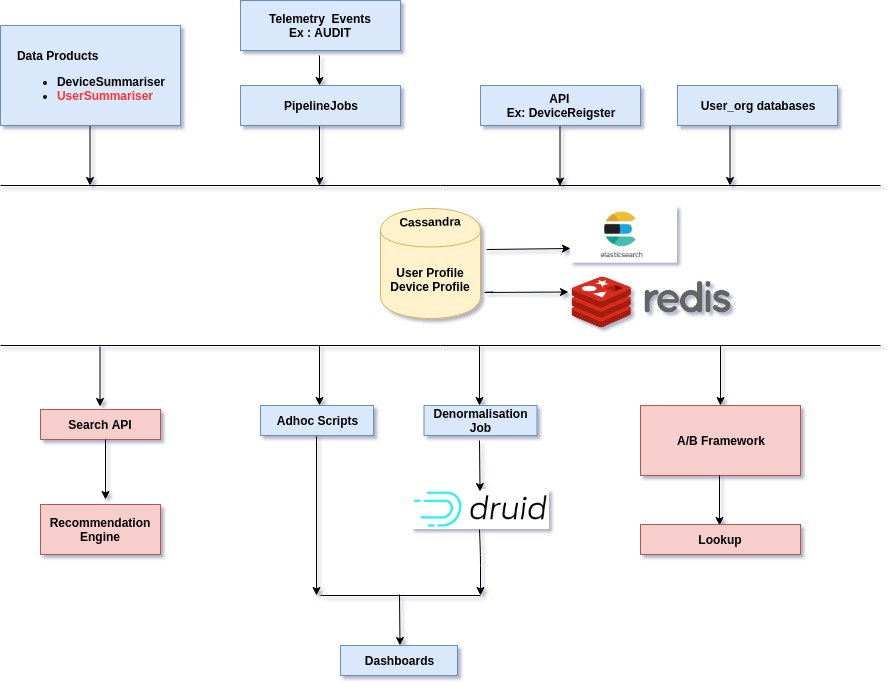

# \[Design]Enhancing-Device-Profile-and-Creating-Extended-User-Profile

**Introduction:**

* This document describes the enhanced/derived Device and Extended User Profile schemas, design of how the profile data is captured and how it can be used across various systems.

**Design Flow:** 

**Schema Design for User and Device Profile** **Computation Table:** **Device Profile -**

|    | Field                   | Type                | Description                                         | Source                                   | Release |
| -- | ----------------------- | ------------------- | --------------------------------------------------- | ---------------------------------------- | ------- |
| 1  | device\_id              | String              | Unique id of device                                 | From first source which inserts a record | 1.11    |
| 2  | total\_ts               | Double              | Total Time spent on device till date                | Device profile updater data product      | 1.11    |
| 3  | total\_launches         | Long                | Number app/portal launches from the device          | Device profile updater data product      | 1.11    |
| 4  | avg\_ts                 | Double              | Average time spent on device                        | Device profile updater data product      | 1.11    |
| 5  | first\_access           | Timestamp           | Timestamp on which device was first accessed        | Device profile updater data product      | 1.11    |
| 6  | last\_access            | Timestamp           | Timestamp on which device was last accessed         | Device profile updater data product      | 1.11    |
| 7  | state                   | String              | State from which device is accessed                 | Device Register API                      | 1.12    |
| 8  | state\_code             | String              | Device state code                                   | Device Register API                      | 1.14    |
| 9  | state\_code\_custom     | String              | Device custom state code                            | Device Register API                      | 1.14    |
| 10 | state\_custom           | String              | Device custom state name                            | Device Register API                      | 1.14    |
| 11 | city                    | String              | City from which device is accessed                  | Device Register API                      | 1.12    |
| 12 | country                 | String              | Country from which device is accessed               | Device Register API                      | 1.14    |
| 13 | country\_code           | String              | Device country code                                 | Device Register API                      | 1.14    |
| 14 | district\_custom        | String              | Device custom district name                         | Device Register API                      | 1.14    |
| 15 | device\_spec            | Map\<String,String> | Device Specification                                | Device Register API                      | 1.12    |
| 16 | uaspec                  | Map\<String,String> | Device user agent data                              | Device Register API                      | 1.12    |
| 17 | fcm\_token              | String              | FCM token for app devices                           | Device Register API                      | 2.1.0   |
| 18 | producer\_id            | String              | Producer id for which device belongs to(App/Portal) | Device Register API                      | 2.1.0   |
| 19 | location\_updated\_date | Timestamp           | last location details updated date                  | Device Register API                      | TBD     |
| 20 | producer\_ver           | String              | Version of producer                                 | Device profile updater data product      | TBD     |
| 21 | user\_ids               | List                | List of unique users accessed from the device       | Device profile updater data product      | TBD     |
| 22 | user\_count             | Long                | Unique users accessed from the device               | Device profile updater data product      | TBD     |
| 23 | last\_updated\_by       | String              | Source from which record was last updated           | Source which is updating the record      | TBD     |
| 24 | sources                 | List                | List of sources from which record gets updated      | From all the sources                     | TBD     |
| 25 | updated\_date           | Timestamp           | Last updated date by the source                     | From all sources                         | 1.12    |

**User Profile -**

|    | Field                  | Type                | Description                                             | Source                                   | Release |
| -- | ---------------------- | ------------------- | ------------------------------------------------------- | ---------------------------------------- | ------- |
| 1  | user\_id               | String              | Unique id of the user                                   | From first source which inserts a record | 2.2.0   |
| 2  | user\_type             | String              | Type of user(Anonymous/SelfSignedIn/ValidatedUser)      | User\_Org Cassandra via Samza job        | 2.2.0   |
| 3  | user\_role             | String              | Role of user(Student/Teacher)                           | AUDIT events via Samza job               | 2.2.0   |
| 4  | sign\_in\_type         | String              | Type of sign-in(GoogleAuth/SingleSignon/Login)          | AUDIT events via Samza job               | 2.2.0   |
| 5  | board                  | List                | Board the user has selected                             | INTERACT event via Samza job             | 2.3.0   |
| 6  | subject                | List                | Subject the user has selected                           | INTERACT event via Samza job             | 2.3.0   |
| 7  | medium                 | List                | Medium the user has selected                            | INTERACT event via Samza job             | 2.3.0   |
| 8  | grade                  | List                | Grade the user has selected                             | INTERACT event via Samza job             | 2.3.0   |
| 9  | language               | String              | User preferred language                                 | INTERACT event via Samza job             | 2.3.0   |
| 10 | profile\_state         | String              | State name of the User                                  | User\_Org Cassandra via Samza job        | TBD     |
| 11 | profile\_district      | String              | District name of the User                               | User\_Org Cassandra via Samza job        | TBD     |
| 12 | profile\_block         | String              | Block name of the User                                  | User\_Org Cassandra via Samza job        | TBD     |
| 13 | first\_access          | Timestamp           | Timestamp on which user was first seen                  | User Profile Updater data product        | TBD     |
| 14 | last\_access           | Timestamp           | Timestamp on which user was last seen                   | User Profile Updater data product        | TBD     |
| 15 | last\_device\_accessed | String              | Device id on which user was last seen                   | User Profile Updater data product        | TBD     |
| 16 | device\_ids            | Map\<String,String> | list of unique devices with device\_id and producer\_id | User Profile Updater data product        | TBD     |
| 17 | last\_updated\_by      | String              | Source from which record was last updated               | Source which is updating the record      | TBD     |
| 18 | sources                | List                | List of sources from which record gets updated          | From all the sources                     | TBD     |
| 19 | last\_content\_played  | String              | Last content played by user                             | User Profile Updater data product        | TBD     |
| 20 | total\_ts              | Double              | overall time spent till date by user                    | User Profile Updater data product        | TBD     |
| 21 | updated\_date          | Timestamp           | Last updated date by the source                         | From all sources                         | 2.2.0   |
| 22 | qr\_scans              | Integer             | Total scans done by the user                            | via data product                         | ?       |
| 23 | ...                    |                     |                                                         |                                          |         |

**Questions:**

* Possibility of switch in user\_role for APP users, Is it ok to have multiple values for user\_role in the telemetry for same user\_id?
* Can we enhance the existing user table or create new one in analytics database.

***

\[\[category.storage-team]] \[\[category.confluence]]
