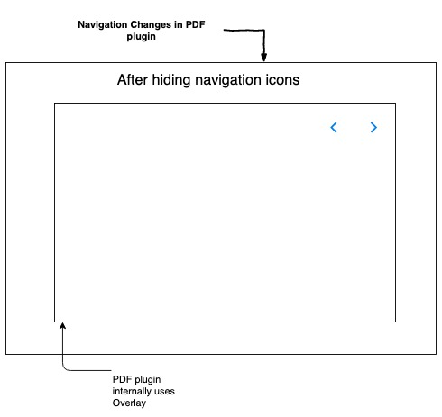

# Navigation-plugin-refined-layout

**Overview:** The following wiki describes the existing problem/Issues with navigation plugin and different ways to fix it.

**Problem statement:** To design the navigation plugin in such a way that, navigation buttons could be placed at any desired position with some configuration or event.

**Background:** The navigate next and previous icons are getting overlapped with contents. Which is not a good user experience while consuming any content.

A general use case is when a user tries to consume any PDF content, the navigation button gets overlapped with the text.

**Solution:** There are two ways to fix this issue. The first approach is to modify the navigation plugin itself.

In the second approach, we could change the appearance of navigation buttons specific to the plugins in which navigation icons overlap with the content.

### **Approach - 1 :**  \[ By using navigation plugin from content-plugins ]

* Navigation plugin can be modified to achieve the desired fix.&#x20;
* We could design a template for navigation buttons as in the  [Final design](https://projects.invisionapp.com/share/WFT8MPMBG8D#/screens/376668271).
* Do a rendering based on the configuration or event data.
* The event or config should have the details of the position\[ eg: top, middle ] to render the template.
*

```
<div ng-show="customNavigationVisible" ng-controller="CustomNavigationCtrl">
	
		<custom-next-navigation></custom-next-navigation>
		<custom-previous-navigation></custom-previous-navigation>

</div>
```

**Pros:**

* We can design the template once and use wherever we want by using conditional rendering.

**Cons:**

* We have to move navigation plugin form content-plugins to player core-plugins in order to use and bundle it.

Diagram illustrating the First approach: 

### \*\*Approach - 2 \*\* **:**  \[ Plugin specific modifications ]

* The existing navigate-next and navigate-previous plugin provide some inbuilt events to hide navigation icons.
* After hiding the icons we could attach the navigation buttons, as in the [Final design](https://projects.invisionapp.com/share/WFT8MPMBG8D#/screens/376668271).
* Attach the navigation events \[nex and previous ] to the new template buttons.

**Pros:**

* We have both the plugins in the player, just need to follow the above process for all the render plugin in which navigation is a problem.

**Cons:**

* As this implementation is specific to the renderer plugin, we may need to do the same changes multiple times for different plugins.

\*\*Diagram illustrating the Second Approach : \*\*



***

\[\[category.storage-team]] \[\[category.confluence]]
