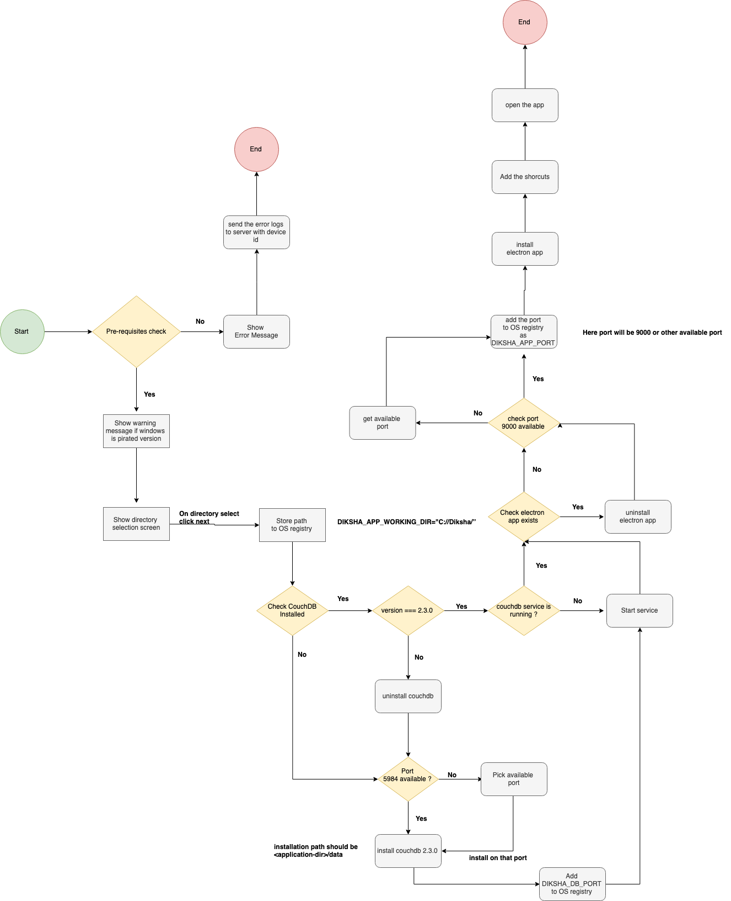

# Offline-desktop-app-windows-packaging

This document explains the step by step process to create the exe file for offline desktop app for windows operating system&#x20;

### Pre-requisites

1. Minimum windows version - Windows 7
2. Minimum RAM required - 2GB(Should show warning if the RAM size is less than 2GB)
3. Minimum disk space required for installation 400MB
4. Minimum disk space required for running the app 10GB

### Registry Variables

1. ${APP\_NAME}\_APP\_WORKING\_DIR - which is used to add the installation location. Example: SUNBIRD\_APP\_WORKING\_DIR="c:\sunbird"
2. ${APP\_NAME}\_DB\_PORT -  which is used to install couch DB default to 5984 if that port is not available then whatever is auto-selected port which is available in system used for couch DB installation. Example: SUNBIRD\_DB\_PORT=5984
3. ${APP\_NAME}\_APP\_PORT - default to 9000 if it is occupied whatever available. Example: SUNBIRD\_APP\_PORT=9000

### Installation Flow

1. **Installation** &#x20;
   1. If the windows is pirated version show the warning message &#x20;
   2. Request for the application directory to install. This should be defaulted to "C://${APP\_NAME}/”? Add this path to the windows registry in the variable “{APP\_NAME}\_APP\_WORKING\_DIR"&#x20;
2. \*\*Couch DB installation \*\*
   1. Check if couch db is already installed.
   2. If “yes” - check the version. If version matches the installer version check if the service is running and start the service. If installed version doesn’t match the version to be installed, uninstall the older version
   3. if “no” then proceed with the installation
   4. Before installation check if port 5984 is under use. If under use switch to another port
   5. Update the port in to the windows registry in the variable “{APP\_NAME}\_DB\_PORT"
   6. Silent install couch DB on the given port.
   7. The couch db configuration should be updated to use the /data as the db path
   8. Restart service
3. **Electron app installation**

#### Error Messages:

Pre-requisites

1. Operating system should be windows 7 or greater&#x20;
2. Minimum 400MB required to install the app.

#### Warning Messages:

Pre-requisites

1. RAM is less than 2GB app may slowdown while using it.
2. Disk space is less than 10 GB app may not work as expected

Installation

1. The operation system is pirated, app may not work as expected

**Note:**

1. Any errors during installation should written to a log file that can be transferred to the server with device id(read reference section below for device id)
2. All the error messages should be read from a file  so that they can be changed easily&#x20;
3. APP\_NAME should be read from file as well
4. Wherever there is error possible installation should stop and the installation log with device id should be sent to server.&#x20;
5. **Uninstall**

**References:**

1. [http://couchdb.apache.org/](http://couchdb.apache.org/) - for couchdb installation
2. [https://www.npmjs.com/package/node-machine-id](https://www.npmjs.com/package/node-machine-id) - to get the device id

Minimum windows version - Windows 7

***

\[\[category.storage-team]] \[\[category.confluence]]
