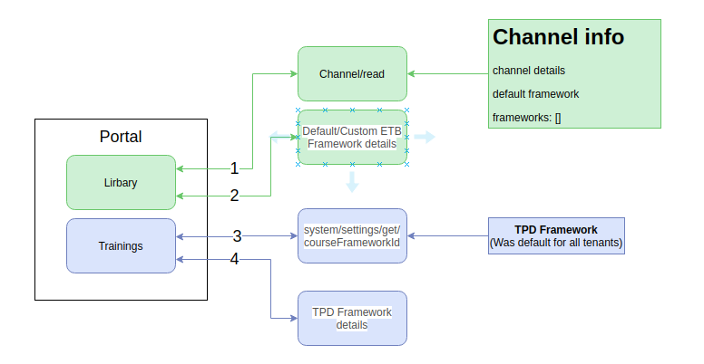
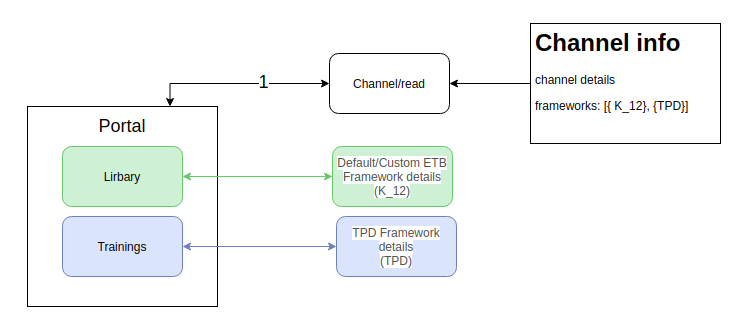
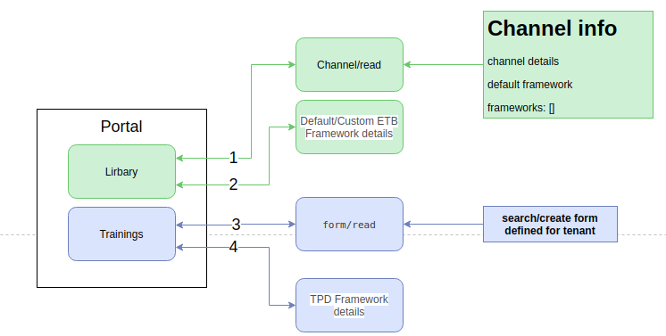

# \[Portal]-Tenant-specific-custom-TPD-Framework-usage

### Introduction:

This document describes the design approach of using the TPD framework in the portal.

### Background:

Jira Issue: [https://project-sunbird.atlassian.net/browse/SH-3](https://project-sunbird.atlassian.net/browse/SH-3)

Epic: [https://project-sunbird.atlassian.net/browse/SH-33](https://project-sunbird.atlassian.net/browse/SH-33)

Presently any tenant is using the framework as customization list of tenant-specific data(BGMS, Topics, sub-topics etc..). This framework is very well defined for ETB workflow

### Problem Statement:

1. How custom tenant framework can be used for content/resources created for course?

### Key design problems:

1. How to get a tenant specific framework(custom/default) TPD framework?
2. How to send Textbook/Course specific framework data(specified by tenant) in the editor config while create/edit of content/resources?

### Existing workflow:

 **Change request:** As part of [https://project-sunbird.atlassian.net/browse/SH-3](https://project-sunbird.atlassian.net/browse/SH-3) we have split creation workflow into 2 parts(in Workspace => Create)

1. Textbook
2. Training

Any resource/content created in Textbook section should use ETB framework defined by the tenant

Any resource/content created in Trainings section should use TPD framework defined by the tenant

### Solution 1:

Get all framework details in the channel read API call(all framework-types).

Channel read API should return the frameworks for this channel. Each framework will be having **“frameworkType“** that will define where to use this framework.

Presently there are 2 frameworks types supported/defined in the platform

1. k\_12 => Used for Library/Textbook workflows
2. TPD => Used for Tanning/Course workflows

Below example is for the channel which has not defined custom frameworks(channel should use default frameworks)

```
{{host}}/api/channel/v1/read/013016492159606784174
```

**Response:**

```json
{
  "id": "api.channel.read",
  "ver": "1.0",
  "ts": "2020-05-12T07:32:55.520Z",
  "params": {
    "resmsgid": "cbae0600-9422-11ea-921e-b5cf18189e8e",
    "msgid": "59d4edd3-9ad3-f3e2-e9c0-1248c8add278",
    "status": "successful",
    "err": null,
    "errmsg": null
  },
  "responseCode": "OK",
  "result": {
    "channel": {
      "identifier": "013016492159606784174",
      "lastStatusChangedOn": "2020-05-08T08:37:06.840+0000",
      "code": "013016492159606784174",
      "frameworks": [
        {
          "identifier": "NCF",
          "default": true,
          "name": "NCF",
          "description": "ETB framework created for CBSE channel",
          "frameworkType": "K-12",
          "objectType": "Framework",
          "relation": "hasSequenceMember",
          "status": "Live"
        },
        {
          "identifier": "TPD",
          "name": "TPD",
          "default": true,
          "description": "TPD framework created for CBSE channel",
          "frameworkType": "TPD",
          "objectType": "Framework",
          "relation": "hasSequenceMember",
          "status": "Live"
        }
      ],
      "consumerId": "ed450daa-a5fd-4295-a346-35ae58c1a602",
      "channel": "in.ekstep",
      "languageCode": [],
      "createdOn": "2020-05-08T08:37:06.840+0000",
      "objectType": "Channel",
      "versionKey": "1588927026840",
      "appId": "local.sunbird.portal",
      "name": "cbse",
      "lastUpdatedOn": "2020-05-08T08:37:06.840+0000",
      "status": "Live",
      "defaultFramework": "NCF"
    }
  }
}
```

Note: In the above response “defaultFramework” : “NCF“ is not required. Because now every tenant has min 2 frameworks. One for Textbook & another one for the Course.

The below table defines the different possibilities of channel defining default & custom frameworks for Library & Training.

Assuming the default framework for **Library/Textbook=NCF** & **Training/Course=TPD**

| **Defined custom** ETB framework | **Defined custom** TPD framework | **Result**                                                                                                                                                                      |
| -------------------------------- | -------------------------------- | ------------------------------------------------------------------------------------------------------------------------------------------------------------------------------- |
| No                               | No                               | Use the default frameworksLibrary/Textbook should use a custom framework => **NCF** Training/Course should use the default framework => **TPD** ex: frameworks: \[{NCF}, {TPD}] |
| Yes                              | No                               | Library/Textbook should use a custom framework => **rj\_k12** Training/Course should use the default framework => **TPD** ex: frameworks: \[{rj\_k12}, {TPD}]                   |
| No                               | Yes                              | Library/Textbook should use the default framework => **NCF** Training/Course should use a custom framework => **rj\_tpd** ex: frameworks: \[{NCF}, {rj\_tpd}]                   |
| Yes                              | Yes                              | Library/Textbook should use a custom framework => **rj\_k12** Training/Course should use a custom framework => **rj\_tpd** ex: frameworks: \[{rj\_k12}, {rj\_tpd}]              |

**Pros** :

* Based on the framework type, consumption will decide which framework to use.
* Will avoid form/read API call to get the TPD framework & also avoids defining forms for each tenant.
*

**Cons** :

* The existing functionality of using the default framework has to change

### Solution 2:

Use form read API call to get which framework to use for create conent/resources.



**Request:**

```
{{host}}/api/data/v1/form/read

request payload:
{
  formType: 'framework',
  formAction: 'search/create',
  contentType: 'framework-code',
  rootOrgId: "013016492159606784174"
}
```

Response:

```
{
  "id": "api.form.read",
  "params": {
    "resmsgid": "812594ec-1ce0-46ed-8311-51225e05f3aa",
    "msgid": "aaddbe0a-e538-4dca-80d7-dde3be09eaf0",
    "status": "successful"
  },
  "responseCode": "OK",
  "result": {
    "form": {
      "type": "framework",
      "subtype": "framework-code",
      "action": "search",
      "component": "*",
      "framework": "*",
      "data": {
        "templateName": "defaultTemplate",
        "action": "search",
        "fields": [
          {
            "framework": "cbse-tpd"
          }
        ]
      },
      "created_on": "2020-05-08T10:06:00.284Z",
      "last_modified_on": null,
      "rootOrgId": "013016492159606784174"
    }
  },
  "ts": "2020-05-12T07:37:48.347Z",
  "ver": "1.0"
}
```

_**Note**_ : Since we are making the same getFormConfig API call to get the custom framework what we are making in the **“Training”** page, then we can take the same from the cache.

If the user is directly coming to the workspace and trying to create anything from the training sub-tab, then only we will make the API call and store it in the cache.

So, When the user goes to the **“Training”** page, we won’t make the API call again.

**Pros** :

* This is an existing workflow. It will be easy to implement.

**Cons** :

* The forms have to define for each tenant for search & create workflows
* Multiple API calls to know which framework to use in search & create
* Maintenance overhead.

***

\[\[category.storage-team]] \[\[category.confluence]]
