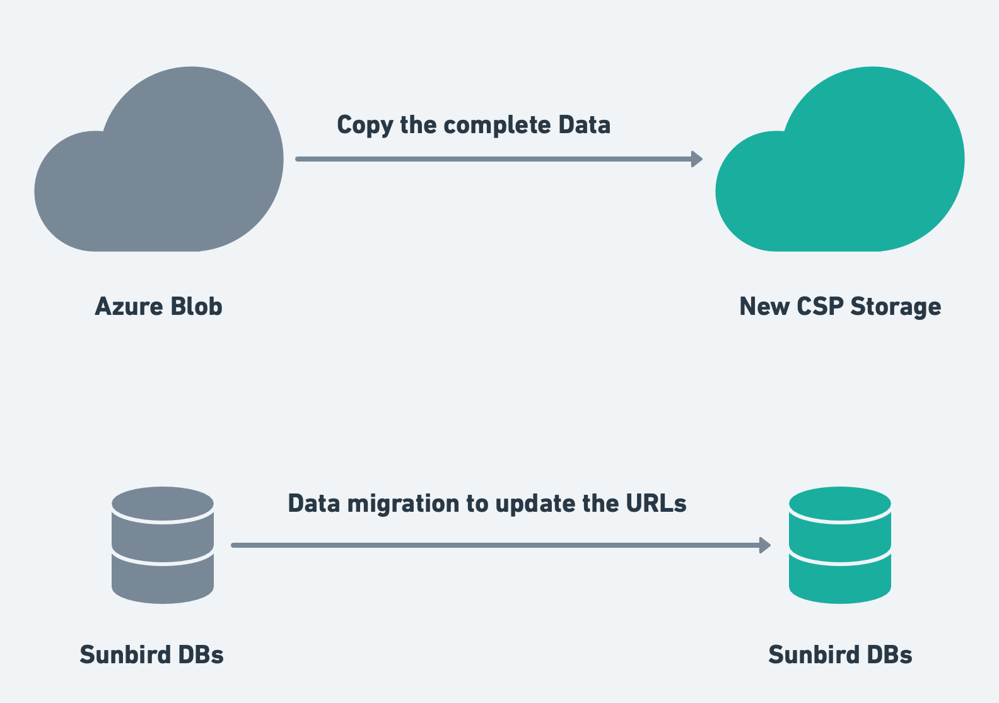
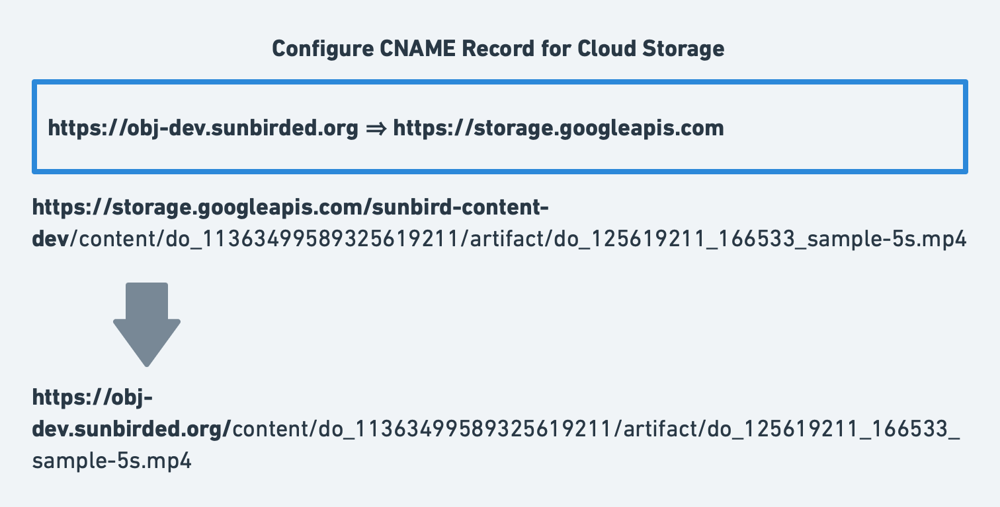

# Sunbird---Cloud-Agnostic-Data

## Introduction

This wiki explains the current format of the data which refers to the could object and the proposed design to make it cloud agnostic.

## Background & Problem Statement

The sunbird platform uses cloud storage in various scenarios to save and access different types of files. The metadata of the functional objects stores the references (URLs) of the respective files to link and understand and provide access to read, modify or delete them.

For example, the content object in the Sunbird Knowlg building block stores the URLs of different files in its metadata to refer to the actual content.

| **Attribute Name** | **Object**                                        | **Sample Data & Details**                                                                                                                                                                                                                                                                           |
| ------------------ | ------------------------------------------------- | --------------------------------------------------------------------------------------------------------------------------------------------------------------------------------------------------------------------------------------------------------------------------------------------------- |
| artifactUrl        | Content, Asset                                    | **Sample:** https://storage.googleapis.com/sunbird-content-dev/content/do\_11363499589325619211/artifact/do\_11363499589325619211\_1664428219533\_sample-5s.mp4Here, the base path of the URL refering to the details about the Cloud Storage.                                                      |
| downloadUrl        | Content, Asset, Collection, Question, QuestionSet | **Sample:** https://ntpproductionall.blob.core.windows.net/ntp-content-production/content/do\_31366273555611648011133/kkssaa-4-paatth-18-kailennddr-bhaag-1\_1667814644274\_do\_31366273555611648011133\_1.ecarHere also, the base path of the URL refering to the details about the Cloud Storage. |

All these URLs of the files are directly stored in the respective databases in most of the scenarios. The data in this format makes it difficult to switch from one cloud service provider (CSP) to another CSP.

To switch from one CSP to another CSP, we need to copy the storage data to the new CSP Storage in the same format and migrate the databases. This data migration is a costly operation and involves a lot of engineering effort.

#### Key Design Problems

1. Replace usage of Cloud Storage-specific URLs in data and metadata.
2. Generalise the base path usage for any CSP usage by Sunbird.

## Design

With the above problem statement, it is clear that we should not use the URLs of the cloud storage provider directly in our databases or any other places. Define a proxy kind of solution for the base of the cloud storage account URL (or base path of the CSP storage service).

#### DNS CNAME Record for CSP Storage Account

Create a CNAME record in the DNS used for the Sunbird installation with CSP Storage base path as value. Use the CNAME URL as the base path while referring to any object or file in the Cloud Storage.

With this to change the CSP for storage, just copy the data from the existing CSP Storage to the new CSP Storage in the same structure and update the CNAME with the new CSP Storage base path. There is no data migration required for the existing data in databases.

**Object Storage URL format for different CSP’s:**

| **CSP** | **URL Format**                                                                                                                                                                                                           |
| ------- | ------------------------------------------------------------------------------------------------------------------------------------------------------------------------------------------------------------------------ |
| Azure   | https://{storageaccountname}.blob.core.windows.net/{container-name}/{file/path}                                                                                                                                          |
| AWS     | https://{bucketname}.s3.{aws-region}.amazonaws.com/{file/path} OR [https://s3](https://s3).{aws-region}.amazonaws.com/{bucketname}/{file/path}                                                                           |
| GCP     | [https://storage.cloud.google.com/{cloud-bucket}/{file/path}](https://storage.cloud.google.com/)                                                                                                                         |
| OCI     | [https://objectstorage.{oci-region}.oraclecloud.com/n/{storage-namespace}/b/{Bucketname}/o/{file/path}](https://objectstorage.ap-hyderabad-1.oraclecloud.com/n/axgooxxsc7qu/b/testgsb/o/level1%2FLevel2%2Ftest-alert.sh) |

Referencing the objects from the Object store/Cloud storage using custom URL is done using the CNAME approach.

Mapping Custom domain to Azure storage account: [https://learn.microsoft.com/en-us/azure/storage/blobs/storage-custom-domain-name?tabs=azure-portal](https://learn.microsoft.com/en-us/azure/storage/blobs/storage-custom-domain-name?tabs=azure-portal)

Below are the example CNAME record configuration for us to understand.

**Sample CNAME :** [https://obj.dev.sunbirded.org](https://obj.dev.sunbirded.org)

| **CSP** | **Value of CNAME Record**                                                                                                                               |
| ------- | ------------------------------------------------------------------------------------------------------------------------------------------------------- |
| Azure   | [https://{storageaccountname}.blob.core.windows.net](sunbird-cloud-agnostic-data.md)                                                                    |
| GCP     | [https://storage.cloud.google.com](https://storage.cloud.google.com)                                                                                    |
| AWS     | [https://s3.ap-south-1.amazonaws.com](https://s3.ap-south-1.amazonaws.com)                                                                              |
| OCI     | It is not possible to define a CNAME record directly for OCI. We need to use API-Gateway or a Proxy to handle it. Need to conclude on the final design. |

The respective code changes for using CNAME in data will be implemented in cloud-storage-sdk. The Microservices should update the version of cloud-storage-sdk and might make minimal code changes to support this.

***

\[\[category.storage-team]] \[\[category.confluence]]
