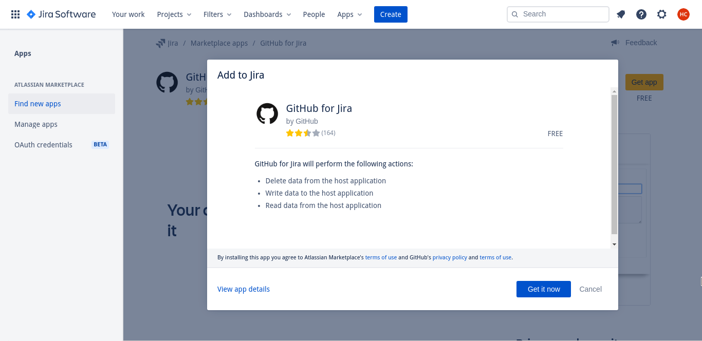
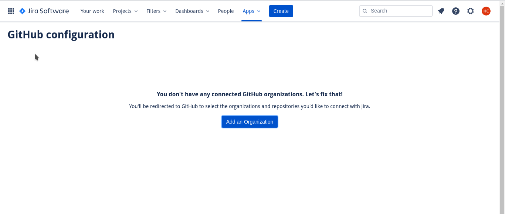
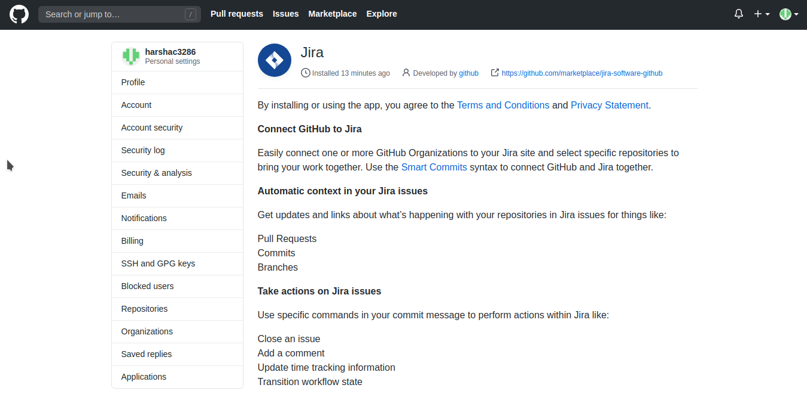
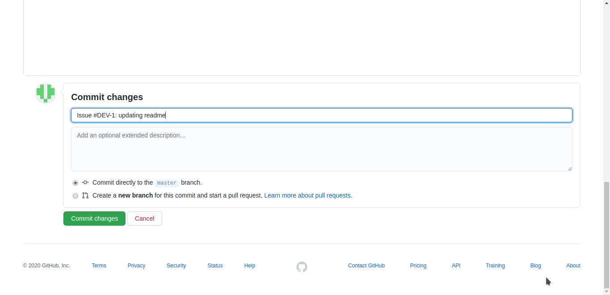
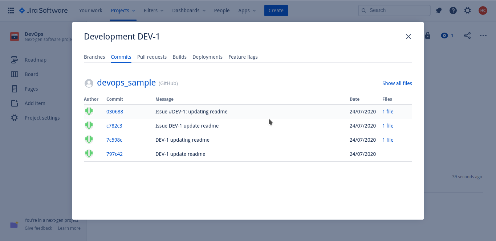

# GitHub-+-Jira-integration

Linking Github with JIRA gives the ability to see branches, commit messages, and pull requests in the Jira tickets the team is working on. On the GitHub side, we can view relevant Jira ticket information in issues and pull requests.

Once the GitHub account is connected with Jira, there is no need to switch between Github & Jira and the entire team will be able to see the work status.

Advantages:

* No need to constantly switch between GitHub and Jira.
* Enforce PR title in a specific format so that team can get a particular Jira ticket for the respective commit or pull request from Github.
* Ability to see all the commit, branches, pull requests raised for the Jira ticket in one place.
* To keep track of code changes done for particular commit/PR with respect to the Jira story/bug/task.

## How To Link GitHub And Jira

Step 1: Install Github app in jira.

Step 2: Add organization and authorzise Jira with github repositories

So, the GitHub app is installed and repositories are authorized.

Use the issue id with the commit message or while raising a pull request.

You should be able to see the commits, branches, pull requests in the respective Jira ticket.

It will also give information about the PR status whether it is open, merged, closed, or declined.

***

\[\[category.storage-team]] \[\[category.confluence]]
