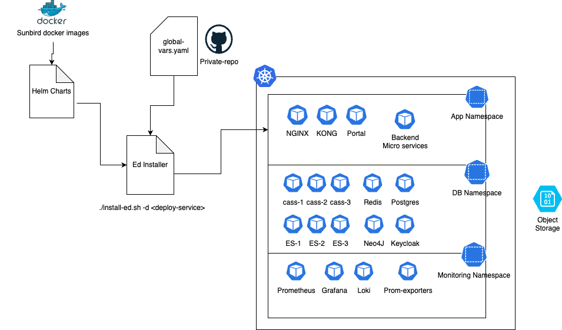
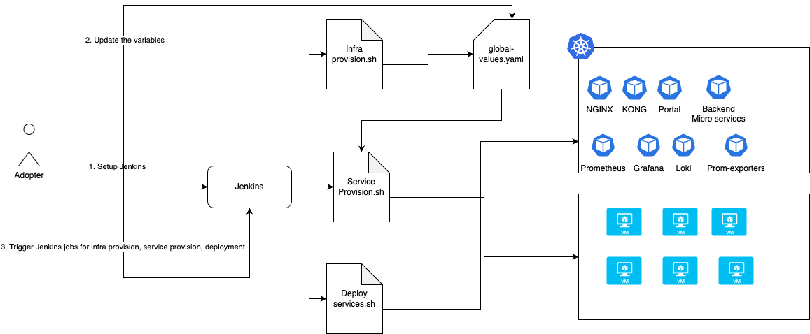

# Sunbird-Ed-Appliancification

This document details out the approach and design to setup Sunbird Ed for different environments along with defined solutions

**Approach1** :

Leverage Easy installer (cli mode) to setup all containerised and non-containerised workloads in kuberentes cluster where all the non-containerised workloads like databases to be run in in HA mode using the respective kubernetes operators. Provide Rancher as part of setup to manage the k8s clsuter

Advantages:

* Installation and upgrade process will be easy
* Cost of infra will be less as all the stateful workloads also run in k8s cluster
* Step towards k8s native
* Open source package unavailability issues will not occur as all the libraries are packaged as container image for non-containerised workloads
* Scale up and scale down of the statefulsets are really easy
* This will lead to adoption of newwer technologies such as tracing, service mesh, knative etc which can bring better visibility, security and scaling mechanisms

Challenges:

* Need additional effort to setup operators for each stateful app and test
* Database management/operations on k8s need to be taken care by SRE team post the installation
* We need to do loadtest and benchmark the throughput
* If statefulsets are scaled without thought, it can make or break the system
* Needs good knowledge of Kubernetes and its ecosystem to ensure system is in a overall good shape
* Some of the development activities will require changes in order to be able to run on Kubernetes

**Approach2** :

Leverage the Jenkins setup where containerised services are deployed to the kuberentes cluster and non-containerised services are deployed on to Virtual machines. Create wrapper jenkins jobs to provision & configure the services and deploy the services

Advantages:

* Leverage existing ansible scripts to setup databases on Virtual Machines (Compute instances)
* Jenkins based installation which user can visualise the builds and deployments
* Most of the things are already in place and doesn’t require any new development effort
* Jenkins UI provides good access management, audit and history of jobs that were triggered

Challenges:

* Manage self managed servers
* Always need to depend on package managers. If a old lib/package is removed, installation scripts will fail
* Need to create Jenkins master jobs which in turn trigger other jenkins jobs of service provision, deploy and configure jobs in automated way
* Users will need to switch context during installation, upgrade and the overall process is not a seem less experience
* Two separate inventory and variable sources need to be maintained - one for the VM apps and the other for Kubernetes apps

**Design discussion points:**

* We can go ahead with implementation of setting up containerised and non-containerised workloads on k8s cluster. Post the installation SRE team should be able to manage the infra including databases.
* Add a disclaimer saying, if the SRE team is not capable enough to manage the database workloads on k8s cluster, it is recommended to setup the databases using cloud managed services or on self managed compute instances
* Do the load testing and benchmark the setup for 1000 tps.
* If the adopter has requirement of more than 1000 tps, it is recommended to setup the databases using cloud managed services
* Enable configurability to connect to the managed database services from microservices and test with one CSP
* Document the best practices to setup and manage the environment including security, scale, monitoring and logging
* Following table shows what should be the production environment setup based on the TPS, Availability and Skillset of the engineers

| **TPS**          | **Application Availability** | **Skill Set of the engineers managing the infra**                                         | **Production setup Recommendation**                                                                                                                  |
| ---------------- | ---------------------------- | ----------------------------------------------------------------------------------------- | ---------------------------------------------------------------------------------------------------------------------------------------------------- |
| < 1000           | < = 95%                      | K8s cluster managementDatabase backup and restore management                              | You can setup Sunbird Ed on Kubernetes cluster where containerised applications along with databases are deployed to k8s cluster                     |
| >1000 and < 3000 | >95% and < 98%               | K8s cluster managementHandling self managed serversDatabase backup and restore management | You can setup Sunbird Ed deploying containerised applications to the kubernetes cluster and databased workloads to the self-managed servers (VM/EC2) |
| >3000            | >98%                         | K8s cluster managementConfigurability to the cloud managed services                       | You can setup Sunbird Ed deploying containerised applications to the kubernetes cluster and databases to the cloud managed services                  |

**NOTE** : If you are looking for higher resilience and availability, we recommend you to go with cloud manged services for databases irrespective of expected TPS

***

\[\[category.storage-team]] \[\[category.confluence]]
