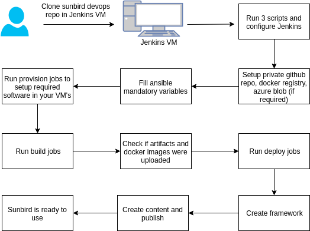

# Running-Sunbird-the-new-way

_Old Approach_ **Pros:**

* Sunbird was installed using a single script.
* Very minimal set of variables to be defined prior to install (about 40 odd variables)
* 1 hour installation
* Low technical knowledge required to setup

**Cons:**

* The configuration file was not version controlled. It was only a local file which had inventory and variables defined
* Customization was tough for docker images
* No control on published contents
* Cannot analyze data patterns
* Only core components are available for use but not Knowledge Platform and Data Pipeline

_New Approach_

**Pros:**

* All components can be installed - LP, DP and Core service's&#x20;
* Easy customization of all components by forking the desired repository
* Spin up a Jenkins instance and start building on your own
* Everything is a Jenkinsfile
* Version control of build, provision and deploy process using Jenkinsfile
* Visibility on how Sunbird does build and deploy by just looking at the Jenkinsfiles
* Docker images can be stored in any registry and artifacts in azure blobs or locally on Jenkins
* Seamless and quick rollbacks
* All features, updates and process of Sunbird available to end users
* 85% of Ansible variables refactored and simplified
* Only about 100 odd variables needs to initialized for entire setup
* 600 variables refactored to about 100 odd variables
* Every configuration can be overridden based on requirements
* Easy upgrades by just using the latest GA certified tag. One click build and deploy.
* Total control on publishing content and frameworks&#x20;
* Minimal hardware - Just 10 servers for entire setup
* Easy scaling of infrastructure - All through Ansible inventory and Jenkinsfiles
* Production ready setup and easy promotion of code from dev to production (Securing Jenkins is out of scope)
* Provided scripts to create environment specific jenkins jobs
* Anyone can run a full stack Sunbird with home brewed customization's

**Cons:**

* Takes a day's effort
* Medium level technical skills required to setup
* Only azure blobs supported to store artifacts at this point of time (can be skipped if stored locally on Jenkins)

**Variables:** _**Old Inventory and Variables Structure**_

_Private                                                                               Public_

\_                                             \_

_**New Inventory and Variables Structure**_

_Private                                                                               Public_

\_                                      \_

&#x20;         &#x20;

\_How was \_ \_this \_ _done?_

* Converted every freestyle Jenkins job to a Jenkinsfile
* Published every Jenkinsfile along with ready to use job configurations
* Constant and non mandatory variables were set to its default which is as per standards&#x20;
* Flexibility to override the defaults and add their own variables
* Setting up Jenkins and all required jobs using 3 scripts.
* Mandatory variables provided in a standard template along with detailed descriptions which needs to be filled
* Documentation on how to setup

_Pictorial representation_

_How will an adopter run this process?_

* Clone sunbird-devops
* Run jenkins scripts and configure Jenkins (3 scripts)
* Fill mandatory ansible variables
* Run provision jobs to setup your environment which enables required softwares
* Start building the jobs and deploy to servers
* Create a framework and start using Sunbird

_How will an adopter upgrade?_

* Clone sunbird-devops
* Run the same jenkins scripts which will upgrade existing jobs and create new jobs as per release
* Add / remove variables as per changelog provided with every release
* Run build and deploy from new GA tag

***

\[\[category.storage-team]] \[\[category.confluence]]
