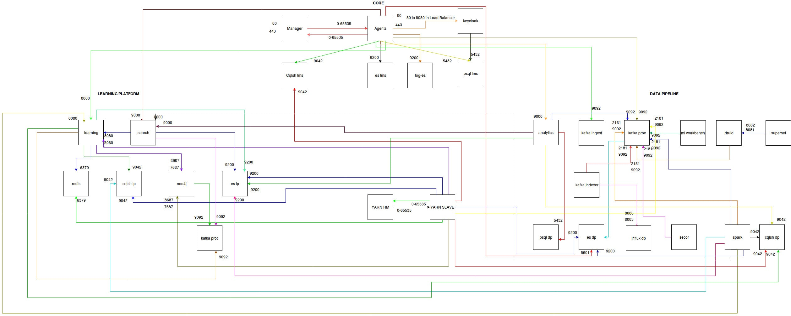

# Secure-the-infra

#### Network Security Groups

* Tightening to control the traffic flow between internal services
* Setting inbound and outbound rules and restricting ports

#### Multi Factor Authentication

* Two-Factor Authentication for Azure portal, Grafana, Kibana and Superset
* Two factor authentication for Jenkins

#### SSH Key Management using HashiCorp Vault

* Vault handles any type of secret data, including database credentials, API keys, PKI keys, and encryption keys.
* Vault also supports dynamic secrets, generating credentials on-demand for fine-grained security controls.
* Vault can authenticate and authorize SSH keys and audit every request

#### Other Security aspects

* Allowing Blob storage access only from internal network and specific VM's instead of using keys
* Kibana, superset and yarn dashboard are accessibly only via VPN&#x20;
* Grafana is accessible from public internet. Only viewer credentials are shared with users&#x20;

***

\[\[category.storage-team]] \[\[category.confluence]]
