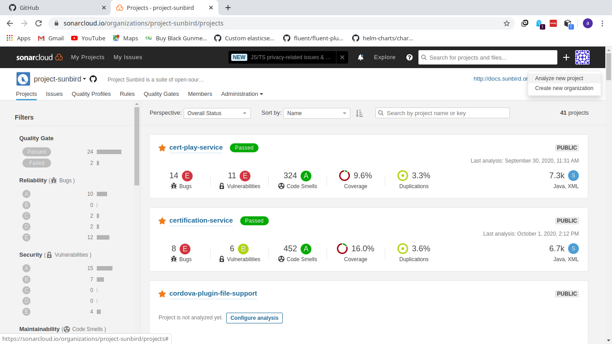
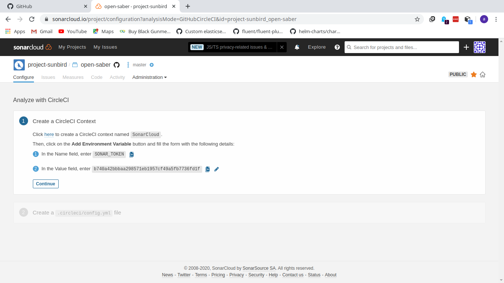

# SonarCloud

Adding new project for analysis.

Login to sonarcloud with Admin privileges. Click on new project.



Select the github repo and the programming language used and select the CI as CircleCI. Then it will give the sample config and token as below, copy the token and add in circleci env variables for the particular project.



### Sample sonarcloud config for JS/TS language:

Create a file by name **sonar-project.properties** in root of the repo and update the below info.

```
sonar.projectName=
sonar.language=
sonar.sources=.
sonar.typescript.lcov.reportPaths=
sonar.projectKey=
sonar.host.url=https://sonarcloud.io
sonar.organization=
sonar.projectVersion=1.0
```

Run sonar-scanner command in circleci config file, it will read all details from this file.

### Sample sonarcloud config for JAVA language:

Add this step in CircleCI by updating all the required parameters.

```
 name: sonar
 command: |
    mvn verify -Dlog4j.configuration=./logs sonar:sonar -Dsonar.projectKey=project-sunbird_sunbird-data-pipeline -Dsonar.organization=project-sunbird -Dsonar.host.url=https://sonarcloud.io -Dsonar.coverage.jacoco.xmlReportPaths=/home/circleci/dp/data-pipeline/assessment-aggregator/target/coverage-reports/jacoco-ut/jacoco.xml
```

Note: If you’re creating a token for SONAR\_TOKEN env variable in circleci, please make sure, that you(sonar cloud user) has execute analysis in [roles](https://sonarcloud.io/organizations/sunbird-ed/permissions)

Ref: [https://community.sonarsource.com/t/error-youre-not-authorized-to-run-analysis-please-contact-the-project-administrator/11979](https://community.sonarsource.com/t/error-youre-not-authorized-to-run-analysis-please-contact-the-project-administrator/11979)

***

\[\[category.storage-team]] \[\[category.confluence]]
