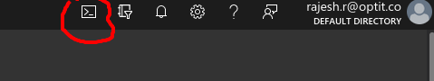

# Test-Release-Installation-of-Sunbird

### Provisioning Azure Infra

* Create Service principle for aks cluster

```bash
az ad sp create-for-rbac --role="Contributor" --scopes="/subscriptions/<subscription_id>" --name sunbird_installation_version
```

* Create Maxmind DB Licence key
  * Open [https://www.maxmind.com/en/accounts/current/license-key](https://www.maxmind.com/en/accounts/current/license-key)
  * Click on

 \* If you don’t have an account, Signup for one on [https://www.maxmind.com/en/geolite2/signup?lang=en](https://www.maxmind.com/en/geolite2/signup?lang=en)

* Create an ssh public key
  *

```
ssh-keygen -C installation_test_key -b 4096 -f /tmp/deployer_key
vim /tmp/deployer_key.pub
```

* Login to [http://portal.azure.com](http://portal.azure.com) → select Cloud shell

 \*

```
git clone https://github.com/project-sunbird/sunbird-devops -b releaese-<version>
cd sunbird-devops/deploy
vim azure-provision.yaml
# Update the mandatory variables.
ansible-playbook azure-provision.yaml
```

* Get all the resource information.

```
cat sunbird-devops/deploy/azure-resources.txt
```

### Configuring Jenkins and Private repo

* Update the IP address for the modules

```
sed -i 's/10.1.4.4/DP     vm IP/g' ./{Core,KnowledgePlatform,DataPipeline}/{common.yml,hosts} # DP
sed -i 's/10.1.4.5/DB     vm IP/g' ./{Core,KnowledgePlatform,DataPipeline}/{common.yml,hosts} # DB
sed -i 's/10.1.4.6/KP     vm IP/g' ./{Core,KnowledgePlatform,DataPipeline}/{common.yml,hosts} # KP
sed -i 's/10.1.4.7/Yarn   vm IP/g' ./{Core,KnowledgePlatform,DataPipeline}/{common.yml,hosts} # YARN
sed -i 's/10.1.4.8/Others vm IP/g' ./{Core,KnowledgePlatform,DataPipeline}/{common.yml,hosts} # OTHERS
```

*   Update the Variable files (common.yaml, secrets.yaml) in Core,KnowledgePlatform,DataPipeline

    Note: Blob, Docker registry secrets will be printed on the console of the azure-provision ansible task, which ran above
* Setup Jenkins as per the doc [http://docs.sunbird.org/3.9.0/developer-docs/server-installation/jenkins-setup/](http://docs.sunbird.org/3.9.0/developer-docs/server-installation/jenkins-setup/)
* In the Build and deploy step([http://docs.sunbird.org/3.9.0/developer-docs/server-installation/build-and-deploy/](http://docs.sunbird.org/3.9.0/developer-docs/server-installation/build-and-deploy/) ), **skip all the prerequisites** and proceed to **Code Builds** Section. Maxmind DBS will be present in

```
Blob storage -> artifacts -> geoip2_db.{zip, tar.gz}
you can give the url of artifact in Jenkins build, if promted
```

*   To get all the branches to build, run the [https://10.20.0.14/jenkins/job/Release/job/OtherReleaseJobs/job/GetBranches/](https://10.20.0.14/jenkins/job/Release/job/OtherReleaseJobs/job/GetBranches/)

    Replay the job and change the release-x.x.x and run the job.

    It will generate a branches.txt file in the Jenkins workspace, which will contain all branch info.
* Update the branch info to [https://github.com/project-sunbird/sunbird.org-docs/blob//developer-docs/server-installation/build-and-deploy.md](https://github.com/rjshrjndrn/sunbird.org-docs/blob/3.9.0/developer-docs/server-installation/build-and-deploy.md)
* Trigger the Jenkins jobs

#### TODO:

* Jcasc
* Jenkins job trigger script

***

\[\[category.storage-team]] \[\[category.confluence]]
