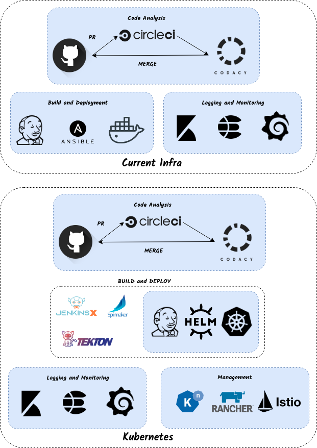

# Tools

### DevOps Tools to manage infra and application life-cycle

### Recommendations

* \[\[Istio|Istio]]
* \[\[Helm|Helm]]
* \[\[Rancher|Rancher]]

### Tools of Interest

* \[\[Knative|Knative]]
* \[\[Spinnaker|Spinnaker]]
* \[\[Jenkins X and Tekton|Jenkins-X-and-Tekton]]
*

### Rio

### - Black and White images depicts **Must Have**

### - Color Images Depicts **Nice to Have**

### Tools Description

1. GitHub: Code Repository
2. CircleCi: Continuous Integration Unit Test environment
3. Codacy: Code Quality Analyser
4. Jenkins: Build and Continuous Deployment Tool
5. Ansible: Configuration Management Tool
6. Docker: Application RunTime
7. Kibana: Visualization tool for Logs
8. ElasticSearch: Log Search Engine
9. Grafana: Visualization tool for Metrics
10. JenkinsX: Kubernetes Native Jenkins
11. Tekton: Kubernetes Native Continuous Deployment Tool
12. Spinnaker: Cloud Native Continuous Deployment Tool
13. Helm: Kubernetes Native Configuration Management Tool
14. Kubernetes: Application RunTime
15. Knative: Kubernetes Native PaaS
16. Rancher: Centralized Management Tool for Multiple Kubernetes Clusters
17. Istio: Kubernetes Native Traffic/Telemetry Management Tool

***

\[\[category.storage-team]] \[\[category.confluence]]
