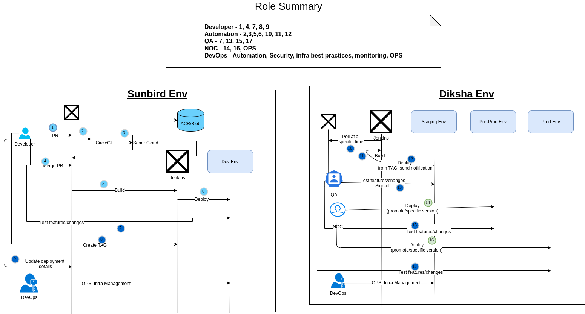
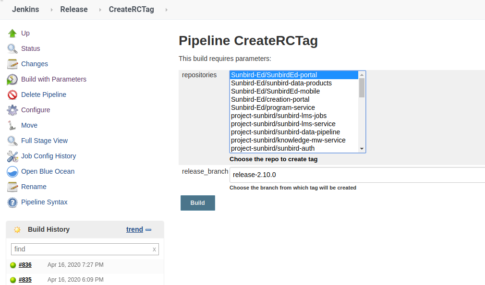
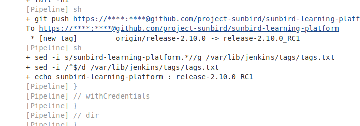
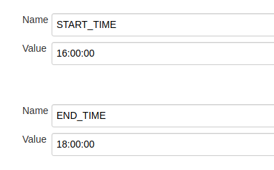
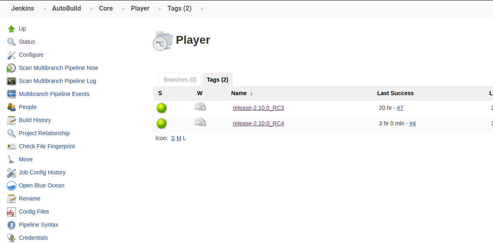
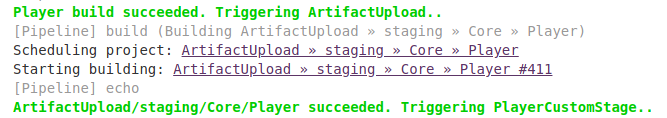
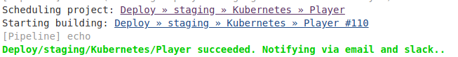
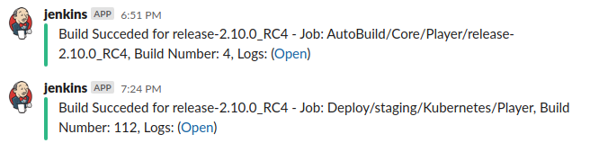

# Automated-Build-and--Deploy

The idea is to automate the build and deployment of various Jenkins jobs to a specific environment based on Github tags.

**What is required from the development team?** Development team will create the tag for their respective github repositories using a Jenkins job.

**How to create tag?**

* Go to the Jenkins job and choose the repository (multi-select enabled)
* Provide the release branch from where the tag needs to be created
* Click on Build

* In the cosole log, the tag will be displayed

**What happens next?**

* Jenkins jobs in staging environment will poll the repositories every 10 minutes to check if any new tags are created in the repo.
* If new tag is found, the code will check if the tag is created in the deployment window. Lets say 16:00:00 to 18:00:00.
* The start and end times are configurable using 2 variables in Jenkins - START\_TIME, END\_TIME
* The tag will also be checked if it has a **\_RC** string and whether it matchs the current release pattern. This is to prevent non RC tags to not trigger deployments and hotfix tags to not trigger staging deployements.
  * _**Example -**_
  * release-2.10.0\_RC1 is valid
  * release-2.10.0, release-2.10.0\_ABC, release-2.8.7\_RC1 are invalid
* Once the above check is passed, a new jenkins job is automatically created with the tag name.
* Based on the job names, the respective build, upload and deploy jobs will be triggered.
* A slack notification will be sent for successful build and successful deployements.
* For intermediate jobs like uploading the docker image, artifacts etc, success notifications will not be sent and only failure notifications will be sent

**Few images depicting the above details** _Start and End time variables_

 _New jobs get created based on tags_

_Downstream jobs triggered automatically based on the status of upstream job_

* Example - Portal build (few images)
  * Stages:
  * Player Build
  * Player Image docker image upload
  * Player Tenant Build
  * Player Tenant docker image upload
  * Player CDN Build
  * Player Deploy

 

_Slack Notifications_

**Current challenges to discuss**

* Few repos have more than one build job, so when tag gets created, all the jobs of this repo will get triggered as we cannot distinguish which job should trigger
  * **Current design:** All these jobs will be triggered and deployed
  * **Solution desired:** Spiltting the service per repo
* Portal and Editors have a strong dependency. So during portal and editor tag creation, portal needs to wait till editors deployment is completed and then start as it downloads the editors from blob
  * **Current design:** Dev team should co-ordinate and create editor tags first and ensure its deployed. After this, Portal should create the tag
  * **Solution desired:** Decouple these in someway
* Certain builds when triggered parallely, causes overwriting of maven artifacts with a different code
  * **Current design:** Do nothing. If things break, it will be a reason to push teams to distinguish their maven artifacts
  * **Solution desired:** Version the maven artifatcs properly in pom.xml and also use different naming conventions per service. Or separate submodules. Or even better, remove the submodules.
* Few Yarn jobs have an option to select only a specific samza job to deploy
  * **Current design:** Deploy all samza jobs always as we dont have away to distinguish which samza job to deploy based on tag
  * **Solution desired:** Unknown
  * **Planned Change:** In Kubernetes, we will implement deployment of specific jobs
* Depoyment tracker updates still need to be done by dev team for a couple more days for artifact promotion tracking and variables tracking. Also dev teams need to ensure variables are commited to private repo before creating tags
  * **Current design:** Variable updates are manual and cannot be automated
  * **Planned change:** A new summary job which will hold details on all the jobs that were run / triggered in that release. The summary file can be used for next environment promotion along with job details, tags etc.
* Certain deploy jobs which dont have a corresponding build job needs to be triggered manually - Example: **Admin dashboard jobs**
* Certain deploy jobs which have non standard parameters needs to be triggered manually - Example: **Neo4jSyncTool**
* Different repos have different release version
  * **Current design** : Trigger those manually as long as they are in same version
  * **Solution desired** : Follow release cycle to start using the automated jobs
* Submodule changes will not trigger a new build
  * **Current design:** Ask teams to create dummy tag in main repo
  * **Soultion desired:** Tagging of submodules and then updating submodule repository to point to these tags instread of branch / Removing the submodules all together
* Tags for staging cannot be created outside the deployment window. Hotfix tag for preprod and above can be created any anytime of the day.

**Updates - 28/04/2020**

* Deployment tracker will still be created for each release. This is to track only manual steps like:
  * New jenkins job from dev jenkins
  * Jenkins job configuration changes
  * Infra changes and provision jobs
  * Anything that needs to be run manually
  * Jobs which are not covered under the automated build and deploy process
* For all ansible code repos like sunbird-devops, sunbird-data-pipeline, sunbird-learning-platform, branch will be used to deploy and no need to create tag for these repos in automated deployments
* Final tag for ansible code repos like sunbird-devops, sunbird-data-pipeline, sunbird-learning-platform will be created before promotion to next environment.
* Any new tags post promotion for ansible code will be done by respective dev teams
* If there is a change in build step of **Jenkinsfile** , the dev teams should also ensure to make this change in a file called **auto\_build\_deploy** which is present in every repo.

***

\[\[category.storage-team]] \[\[category.confluence]]
