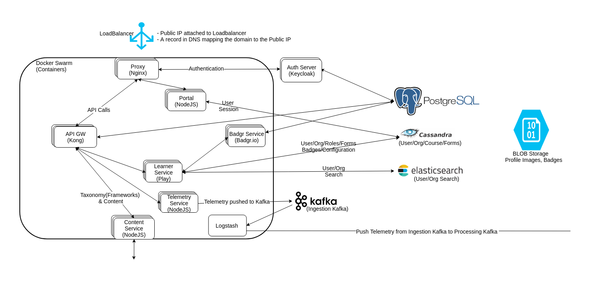

# Basic-Info

**WHY ?** **Current Infra**

#### Docker Swarm as the orchestration engine

Pros:

* Solves lots of issues, like container lifetime and ease of deployment(up to a point)
* Simple to setup
* Less complicated (comparatively)

Cons:

* Ops at scale is hard ( like swarm reset, network issues)
* At scale it doesn't have the knobs to control the infra nuances unto our liking
* Autoscaling or other cloud-native goodies are absent
* No way to get realtime telemetry or metrics about the state of infra (especially service communication)
* No platforms like knative or istio, which is an instant value add-on for both/infra and addon

### Container Fundamentals

* **VM vs Container**

 

* **Key concepts of container**
  * Containers are applications which is restricted by kernel feature called namespaces
  * pid - Process Namespace
  * net - Network
  * mnt - FileSystem
  * usr - UserID
  * utc - hostname
  * ipc - semaphores, channels
  * Cgroups will limit the resource usage
  * ResouceUsage
  * Memory
  * CPU
  * Block I/O
  * Network
  * Device Node access control
  * /dev/\*
* **Docker is an engine which makes such containers. There are alternatives like containerd, rkt etc**

***

\[\[category.storage-team]] \[\[category.confluence]]
