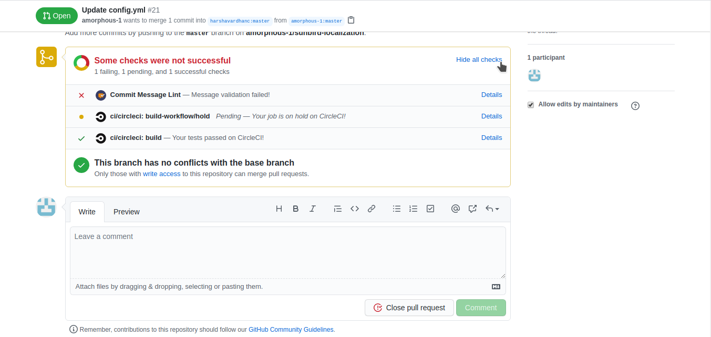
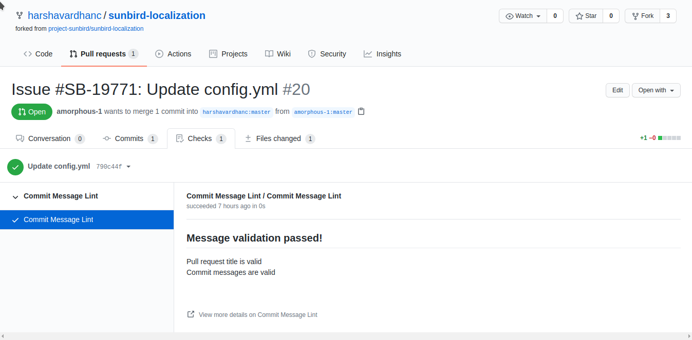
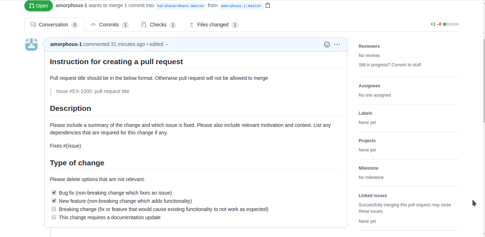

# Best-practices-for-raising-a-pull-request

**PR should have the following details:**

* PR description must have a JIRA ticket (which is approved and tagged to a release).
* If you're aware of the relevant Tech Owner (refer to [#1](https://github.com/project-sunbird/sunbird-community/discussions/1) ), tag them while submitting the PR for faster resolution.
* Must be raised to a branch associated with the target release of the JIRA ticket.
* The contributed code must have a minimum unit test code coverage of 80% (or what ever is configured in sonar cloud for the project).
* Must follow the coding standards & guidelines of Sunbird (configured on sonar cloud - [https://sonarcloud.io/organizations/sunbird-ed/rules](https://sonarcloud.io/organizations/sunbird-ed/rules) ).
* Test Scenarios: Contributors must attach the list of test scenarios verified by them for this PR. (sample format available here - [#20](https://github.com/project-sunbird/sunbird-community/discussions/20))
* API Tests: If the contribution is a new API or changes to an existing API, all test scenarios must be automated and contributed.
* Test Results: Following should be attached to the PR or the corresponding JIRA ticket (as proof of validation)
  * Test results file - results (pass/fail) and observations of all test scenarios
  * Automated API tests results, if applicable

**PR Reviewer should validate the following:**

* Check for availability of JIRA id with approval and target release in PR description.
* Validate the GitHub branch against the target release of JIRA ticket.
* Coding standards & guidelines check by Sonarcloud
* Unit test execution and code coverage check by Sonarcloud
* Review of the test scenarios
* Review the API automation tests, if applicable
* Verify the attached test results
* Execute the API automation tests, if applicable
* Deploy the contributor code in the local machine and do a sanity test
* Check for the following in the code review
  * assertions in unit tests & API automation tests
  * Actual implementation: check for backward compatibility, and all possible scenarios
  * check if required telemetry events are being generated and in the correct format
  * check if enough logging (with appropriate log levels) is there in the contributed code
  * Performance & Scale checks: avoid unnecessary db calls, usage of correct databases & queries, has required caching
* Optional: Get the PR review done by at least two reviewers

_After the validation is complete, PR can be approved & merged._

More Details:

#### Enforce pull request title message format

Conventional commits:

A specification for adding human and machine-readable meaning to commit messages. The Conventional Commits specification proposes introducing a standardized lightweight convention on top of commit messages.

By introducing this convention, we create a common language that makes it easier to debug issues across project boundaries.

**Why Use Conventional commits:**

* Helps in integrating Jira and Github.
* Communicating the nature of changes to teammates, the public, and other stakeholders.
* Making it easier for people to contribute to your projects, by allowing them to explore a more structured commit history.
* Easy to generate CHANGELOGs.

Recommended commit message format:

```
Issue #EX-1000: pull request title
```

* Commits MUST be prefixed with a type, which consists of a noun issue, feat, fix, chore, etc., followed by a colon and space.
* Next, it should be followed by # and the respective Jira ticket id #SB-0000, it will help to link to the respective Jira ticket from Github.
* The last part should the description is a short description of the code changes.

Adding Github checks for enforcing the conventional commits.By adding Github check we can make sure that the pull request title is in a specified format. If the title is not in the specified regex pattern it will block pull request.

Pull request title which doesn’t match the required pattern.



Pull request with proper PR message title which matches the required pattern.



Reference: [https://www.conventionalcommits.org/en/v1.0.0/](https://www.conventionalcommits.org/en/v1.0.0/)

[https://github.com/SystangoTechnologies/commit-message-lint](https://github.com/SystangoTechnologies/commit-message-lint)

### Adding a pull request template while raising a pull request.

* Adding a pull request template helps to include a structured way of describing the change in code.
* It helps the outside contributor to know about the checks and how to raise a pull request.
* The checklist can also be added which helps to easily identify whether the changes or pull request is for a defect, new feature, breaking change, or document change. etc.,

For adding this template we have to create a .github directory in the project root directory and create a file with name PULL\_REQUEST\_TEMPLATE.

Sample pull request template.



Merging strategy for release branches **Problem** : If a pull request is raised between two branches of the same repository. The sonarcloud analysis for the PR will be in a pending state.

Sonarcloud publish is not working Expected — Waiting for status to be reported

If we push a commit to a branch on Github, CircleCI will trigger a pipeline which will then trigger a SonarCloud analysis on that branch. If we open a pull request for that branch afterward, there will be no new CircleCI pipeline triggered, and therefore there will be no SonarCloud analysis of the pull request. The SonarCloud check will therefore not be satisfied.

If you push changes to an already open pull request, CircleCI will detect that there is a pull request open for that commit. In that case, the SonarCloud analysis will run on the pull request, and it will satisfy the SonarCloud check on the PR.

[https://community.sonarsource.com/t/sonarcloud-publish-is-not-working-expected-waiting-for-status-to-be-reported/17638/3](https://community.sonarsource.com/t/sonarcloud-publish-is-not-working-expected-waiting-for-status-to-be-reported/17638/3)

**Solution:**

While merging the release branches or any branch, a pull request should be created from the fork repository instead of raising the PR from the same repository.

***

\[\[category.storage-team]] \[\[category.confluence]]
