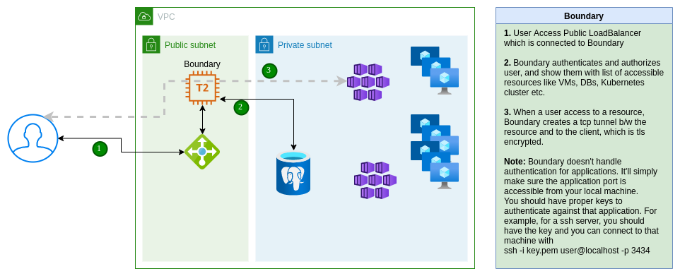
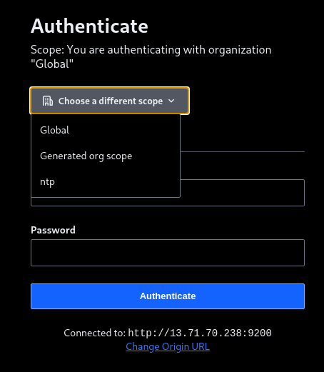
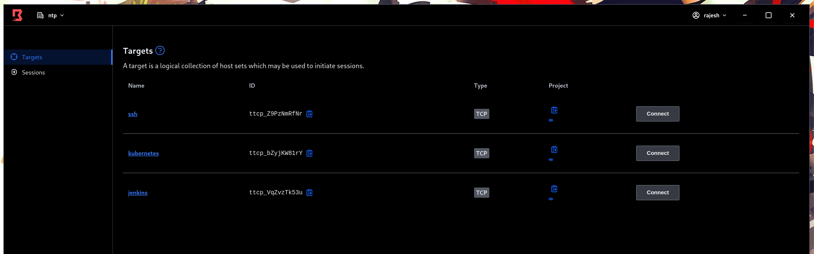
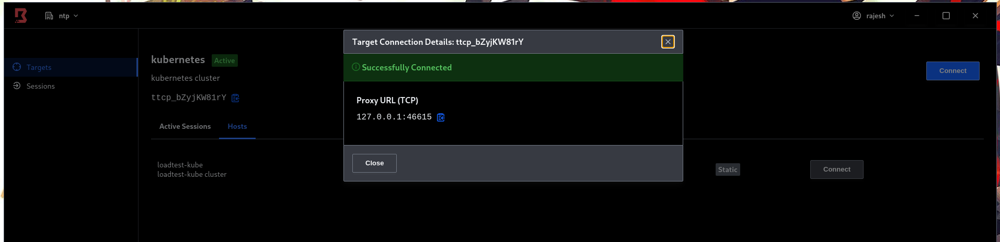
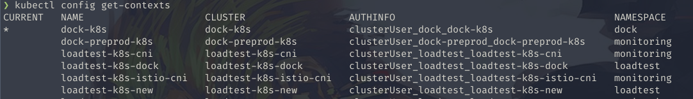
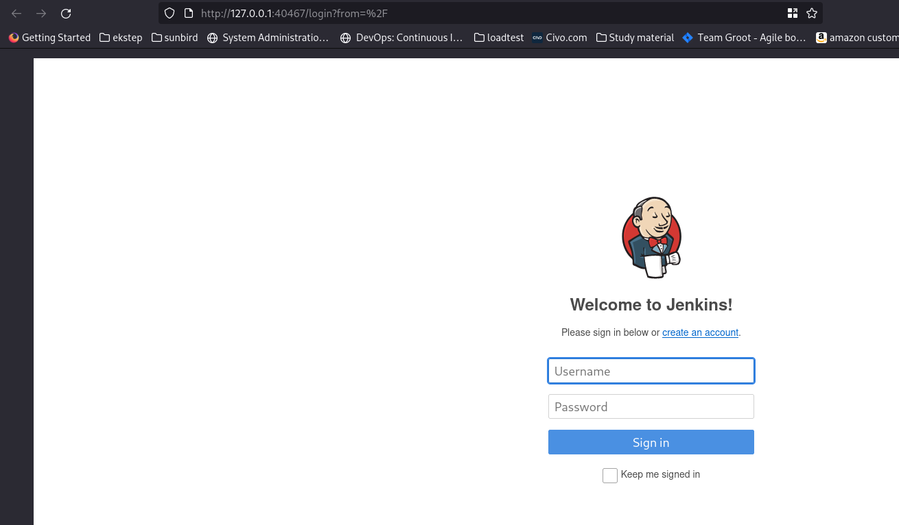

# Connect-to-Boundary

#### Boundary is the gateway to sunbird infrastructure



Simplified architecture is given above.

#### How to connect

1. Get the boundary address, username, password from admin
2. Download the boundary client from [https://www.boundaryproject.io/downloads#desktop](https://www.boundaryproject.io/downloads#desktop)
3. Login with the provided credentials after selecting proper organization



1. Once you logged in, you’ll see a list of authorized targets.



1. Select the target → Host and click connect



1. If you’ve used
   1. **Kubernetes**
   2. Make sure you’ve proper kubeconfig to authenticate against the cluster. You can use kubectl config get-contexts to get check the correct cluster.



```
1. Enable inscure-tls, as the cluster client certificate is not signed for 127.0.0.1 ip

```

```bash
kubectl config set-cluster <replace with the cluster name from above> --insecure-skip-tls-verify=true --server=https://127.0.0.1:56615 # This is the ip you've got from the connect
```

Note: You’ll have to do this every time when you make a new connection, as the port will be random

```
1. Now you can connect to your cluster using your choice of client, like kubectl or k9s or so


1.  **SSH** 


1. Copy the connect ip address, say you got 127.0.0.1:38203


1. The only difference from a normal connection is that you’ll have to specify the port, and the ip address will always be 127.0.0.1.

ssh -i /path/to/ssh_key_file username@127.0.0.1 -p 38203


1.  **Jenkins** 


1. Copy the connect ip address, say you got 127.0.0.1:40467


1. Paste it in your browser, and you’ve access to jenkins

```



***

\[\[category.storage-team]] \[\[category.confluence]]
