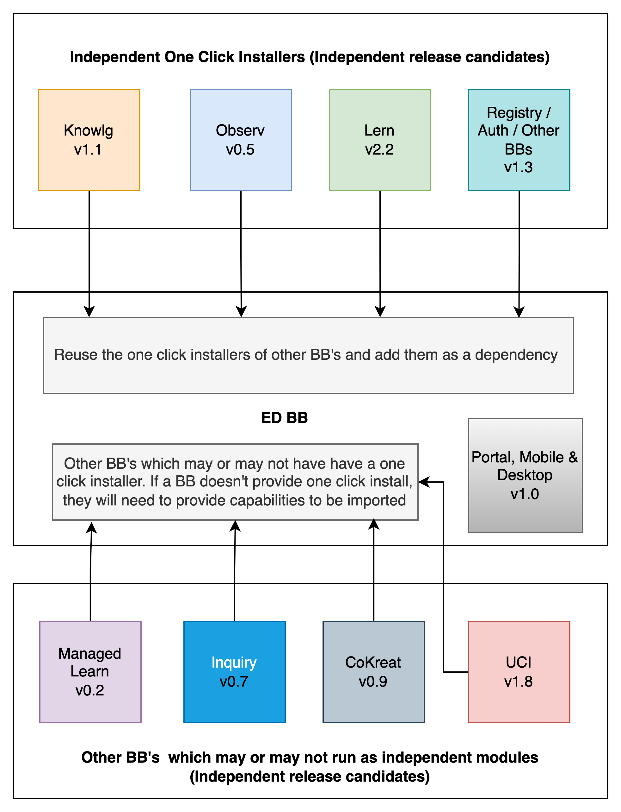
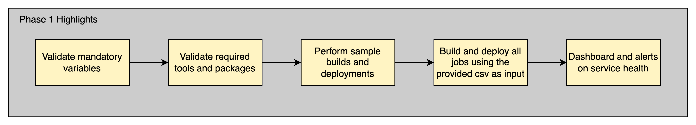
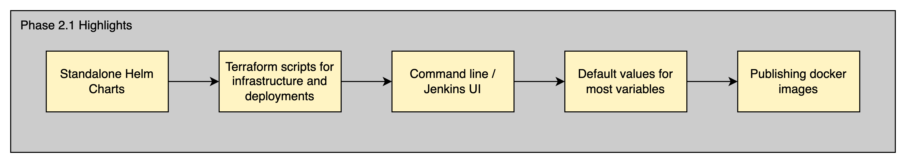
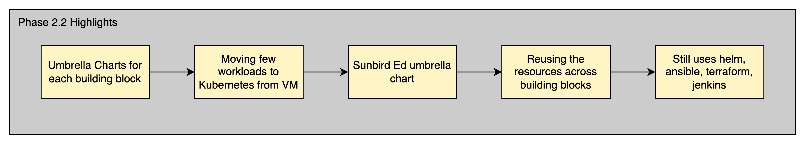
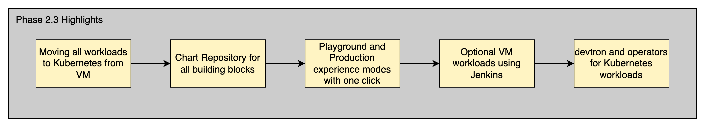
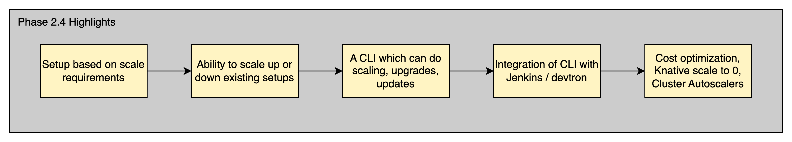
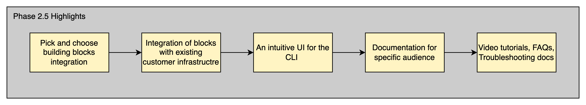

# Ease-of-Installation-of-Sunbird-Ed-Building-Block

Objective of this page is to describe the current challenges in installing Ed building block, how do we solve them, implementation design and execution plan.

**What are the current challenges?** Adopters of Sunbird Ed are having following challenges/concerns while installing Sunbird Ed building block in to their Cloud service provider account&#x20;

a) It takes approximately 3 weeks to install and set up Sunbird ED

b) It takes significant time for adopters to identify and debug issues without proper tools

**Approach to address these challenges:** In this document, we’ve articulated our approach to address the challenges currently faced when deploying ED. This is a working document, and will be further iterated based on community feedback.

#### One click install for Ed

* Each BB needs to provide a one click installer to setup their BB
  * Knowlg, Obsrv, Lern, Cokreat, Inquiry etc.
  * If a BB is tagging along with Ed, then they will be part of the one click installer for Ed (example Inquiry, Managed Lern) and one should be able to import them as a depedency
* Ed BB one click installer will leverage the one click installers of all other dependent BB’s

#### Implementation Phases

Phase 1 :

* _One click installer for Ed BB_
  * Integrating all other BB’s
  * Ability to run with a minimal input variables from the user
  * Moving database workloads into Kubernetes from VM
  * Initial data set for forms, frameworks, users, organisations etc (functional configurations) using postman collection
  * Publishing standalone chart on helm repository
  * Publishing container images to docker registry
  * Documentation on how to run the one click installer
* _One click installers for non Ed BB_
  * Installer to setup BB specific micro-services
  * A standard design for variables used by micro-service in Helm charts
  * Publishing standalone charts on helm repository
  * Publishing container images on docker registry

Phase 2 :

* _Easy installer_
  * Ability to turn on / off certain features
  * Automated cloud infra and stack Provision using Terraform / ansible
  * Auto publishing the container image/helm chart release artifacts
  * Benchmark the results for 100k, 1000 tps, 2k tps, 5k tps and 10k tps
  * Support to upgrade the version
  * Support to install sunbird ed on AWS and GCP. Enable configurability to support AWS and GCP
  * Enabling configurability to connect to the existing/managed databases
  * Fine tune CPU and Memory limits/requests to cost optimise the infra
  * Create one Umbrella chart per BB to deploy all the dependent services
  * Enable options to re-deploy a specific service after complete setup is done
  * Enable monitoring and logging
  * Minimise the variables that user provides as input to the installer
* _How to guides on_
  * Setting up production ready environment
  * Setup Sunbird Ed infrastructure based on required TPS
  * Enabling monitoring and logging of services
  * Checking the health of all the services
  * Debugging infra issues

#### Implementation Details (Expanded contents of the above Phases):

* One click installers should provide flags to turn on / off certain components so that the components can be reused
  * For example, Ed BB will need only one instance of a particular database system
  * Ed BB will turn on the flag only in one of the BB to provision the database and turn off this provision in other BB’s (if they are also creating)
* Run with minimal set of variables and provide flags to turn on optional features
  * For example, recaptcha and maxmind database should be optional
* Expose the configurations by providing variables which can be used to customise the setup
  * For example, the domain value should be exposed by every BB in a standard format
  * Ed BB will define this value once and all other BB’s should be able to use this value
* Support running all workloads in Kubernetes
  * This may require moving few workloads from VM to Kubernetes
* Provide terraform scripts if VM workloads are required (can be contributed by community / CSPs)
* Publish its standalone helm charts on a helm repository
* Perform automated migrations during upgrades and avoid manual migration process
* Should ensure the builds are reliable and stable by performing automated weekly builds
* Provide ability to turn on / off certain features
* Provide clear docs on breaking changes, API changes, features, upgrades etc., in release notes
* Configurations should have a UI (BB specific solutions)
  * For example, configuring frameworks, forms and taxonomy etc
* One click installers should provide scaling ability based on required load which can be achieved using helm / go templates
  * For example, setting up the application bases on 50, 100, 1000 tps and so on
* New automations and process to perform operations
  * For example, volume backup of applications and databases running on Kubernetes
* Documentation on setting up and managing production work loads, handling day to day operations and debugging issues
* Documentation on many of the _how to_ docs and monthly upgrade process

How do we want to address them?We would like to address the above mentioned challenges/concerns in different phases. &#x20;

**In Phase1** , we would like to target to improve the adopter experience by reducing the time and effort it takes to install and setup Ed building blocks. This will reduce the install Ed from 7 days to 3 days. We will do the following to address these&#x20;

* Fix the issues faced while executing the build, provision and deployment instructions in release 4.10
* Write wrapper jobs which in turn trigger all the required Jenkins jobs automatically so that adopter need to trigger only few jobs instead many jobs which saves time and effort. This will be done by creating a master Jenkins job for builds, provision and deployment of each dependent BB by taking the Jenkins job path, release TAG as input

**In Phase2** , we would like to address cost optimisation of cloud infra to install Ed, reducing the time to install to 1 day, minimising the variables to be initialised, improving the installation experience through CLI mode wizard. This will reduce the time to install Ed to 1 day and cost of minimum infra required to setup Ed approximately by 30%. We will do the following to address these &#x20;

* Create terraform scripts and a single a helm chart for Ed building block to deploy all the state less and stateful applications in the Kubernetes cluster which reduces the cost of cloud infra &#x20;
* Fine tuning the CPU and Memory requests and limit configurations to run Sunbird Ed building block with bare minimum resources &#x20;
* Option to deploy micro services to the Kubernetes cluster and stateful applications like databases to the Virtual Machines to enable adopters to run production like workloads&#x20;
* Publish build artefacts docker images and non-containerised artefacts from each BB which saves overall time to deploy and issues faced while building from source code due to dependent libraries are not being available
* Refactor and reduce the number of variables to be initialised to 20&#x20;
* Provide options to choose scale requirement in terms of tps for 100, 500 and 1000 tps and provision the infra to support the same. Also, provide a wiki page detailing how to scale beyond 1000 tps
* Develop CLI wizard that guides the adopter to install Sunbird Ed&#x20;

Implementation Design (Along with Execution Plan):&#x20;

Phase 1:

In phase 1, we would like to add few additional functionalities to improve the adoption experience

* Develop a new Jenkins job which an adopter will execute as the first job. This job will check all the variables defined and report errors if any variables are missing or incorrect. This step will greatly reduce the errors at the later stages of installation.
  * For example, if the adopter misses the env variable, almost every job will fail. So we can check for all the mandatory variables before hand and report if any errors. We will use a combination of ansible, python and Jenkins Pipelines to achieve this.
* Develop a new Jenkins job which the adopter will run as the second job. This job will test the overall functionality involved in build, artefact upload and deploy stages. This step will greatly reduce the errors while running the jobs. We will use a combination of ansible, python, bash and Jenkins Pipelines to achieve this.
  * For example, we will check
  * If the required packages are installed on Jenkins
  * Test if a sample docker, maven and node build succeeds
  * Test if a docker image push and object upload to buckets work using the variables defined
  * Test if we can deploy a sample container to Kubernetes and some sample package to VM’s
* Develop a new Grafana dashboard along with relevant Prometheus alerts and endpoints which will monitor all the service endpoints and report if any of the service is down. This will greatly reduce the errors in the application deployments, post installation and configurations. We will develop these using prometheus alerts, service monitors, scraping rules etc.
  * For example,
  * The dashboard will show if neo4j, redis etc are not running
  * The dashboard will show if learning-service or content-service is down
* We will publish a csv file which will contain the list of jobs and corresponding tags for new installation as well as for every Ed release upgrade starting from 5.1.0. We will create a new Jenkins job which will read this csv file and then in turn trigger all the jobs with their respective tags as per the csv files. This will greatly reduce the adopter’s time to trigger every job manually in case of new install or upgrade. We will develop this using Jenkins pipelines and Groovy scripts

Phase 2:

The Phase 2 activity will be broken down into multiple small phases. We are listing down some of the phases we have identified along with the activity in those phases.

Phase 2.1:

In phase 2.1, we will mainly focus on running the micro services as an independent module

* We will first need to create the standalone helm charts for each micro service. An adopter must be able to take an individual micro service if he desires.
* We will provide the terraform scripts to create the Kubernetes infra with recommended security configurations and networking rules on the top 3 cloud providers. We can also use terraform to deploy the applications on Kubernetes
* If a micro service cannot run individually, then we will add the dependent charts as sub charts for the micro service. For example,
  * If we need neo4j in order to run content-service, then we will add the neo4j helm chart as a dependency chart. When an adopter installs content-service they will also get the neo4jas part of the setup.
* In phase 2.1, If the dependency cannot run on Kubernetes and requires a VM, then we will provide the required terraform scripts to deploy the dependency on the top 3 cloud providers.
  * For example, if we decide to run neo4j on a VM in this phase, then we will provide the terraform script which does the following
  * Create the VM on cloud with recommended security configurations and networking rules
  * Invoke the required ansible playbooks to deploy the packages, setup schemas etc.
* The activities of phase 2.1 will be done through command line by invoking the required commands such as helm, terraform or ansible etc.
* In case an adopter prefers a UI, we will provide a Jenkins job which does the same operations (if we find a better tool than Jenkins, we might switch Jenkins with the new tool). Jenkins is an optional step and is required only for those who want to run operation workloads such as backups, asset uploads to buckets etc,.
* While designing the individual helm charts, we will use default values for most of the variables and ask only the mandatory variables from an adopter (example - cloud storage secrets).
* All the required docker images will also be published by Sunbird on the docker registry.

Phase 2.2:

In phase 2.1, we created individual helm charts along with terraform scripts. In this phase, we will create the umbrella helm charts for each building block

* An umbrella helm chart installs the entire building block such as knowlg, obsrv etc.
* We will use the concept of subcharts for the umbrella chart. When an adopter runs the umbrella chart, it will install all the components that are required for a building block.
* In this phase we will also plan to move some of the VM workloads into Kubernetes (those which are already tested and benchmarked). For example, Kafka, Druid etc.
* The Sunbird Ed chart will be an umbrella chart which will consist of the other building blocks umbrella charts.
* In this phase we will also focus on sharing the server resources across various building blocks when installing the Ed block. For example, we should run only one instance of cassandra for Ed instead of individual cassandra for each building block to save cost.
* Ed BB can be installed easily by running a single helm command to setup the Kubernetes workload and a single terraform command to setup the VM workloads.

Phase 2.3:

In phase 2.2, we have simplified the overall Ed installation process into 3 main steps

* Fill in the required variables
* Run the terraform script to install the helm chart create and deploy services (on kubernetes and VM)
* (Optional) Setup jenkins using a one click installer in case you want to run the operation workloads such as backups, uploading assets to cloud storage etc.

In this phase we will focus on a few important things such as

* Moving all the VM workloads to Kubernetes. For example , running cassandra, elasticsearch etc on Kubernetes.
* Publishing the Sunbird Ed and all other building block helm charts on our own helm chart repository.
* An adopter will be able to install any building block directly from the helm chart repository with just one click. We call this as the Playground Experience. We will achieve this by ensuring the below
  * All variables will have a default value and an adopter need not provide any input. This will allow the charts to be truly one click
  * We will setup minio on Kubernetes for cloud storage. This avoids dependency of a cloud provider
  * We will use a nip.io domain as ingress domain. This avoids dependency on procuring a domain
  * Only a Kubernetes cluster will be required, which the adopter can setup using the provided terraform scripts
  * This type of installation is suitable only for demos, playgrounds, quick experience of Sunbird building blocks
* An adopter must provide their environment specific values such as domain, cloud storage details etc., if they plan to run production workloads. The playground mode is not recommended for production workloads.
* An adopter will also have the option to run VM workloads (for example, cassandra) if they desire by using the provided terraform scripts along with enabling / disabling few flags in terraform / helm charts.
* For VM workloads we will continue to use Jenkins. For Kubernetes workloads we plan introduce a tool such as devtron to manage the build and deployments of the micro services
* We will also introduce Kubernetes operators to manage the operations on Kubernetes such as backup and restore of data etc.

Phase 2.4:

In phase 2.3, we have achieved true one click install of any building block. In this phase, we will focus on some important enhancements such as

* Develop different building block installation solutions based on the scale required by the adopters such as 100 users setup, 1k users setup, 10k users setup, 100k users setup etc,.
* We can achieve this by using helm / terraform templates along few custom scripts.
* An adopter just needs to select one of these options during the setup. All the workloads will be scaled up or down as per input. An adopter will also be able to scale up or down an existing cluster at any given point of time in future and it does not require a new setup.
* We will develop a CLI program which can do the scaling and a couple more activities such as updating only a few building blocks, perform full upgrades etc., for the adopters.
* We will also integrate the CLI tool with an UI such as Jenkins / devtron.
* In this phase we also focus on cost optimisations and reducing the overall infrastructure and maintenance cost. For example, auto scaling the Kubernetes cluster, scaling down the pods to 0 using Knative or similar technology etc.

Phase 2.5 (Still in ideation):

In phase 2.4, we have almost achieved what we intended with respect to the installation and upgrade of building blocks. In this phase we will focus on interactive integrations between building blocks such as

* Develop a fun and interactive mode for an adopter to pick and choose few building blocks and integrate them together.
* Provide an interactive mode for an adopter to integrate one or more building blocks into their existing systems.
* Develop an intuitive UI (or use an existing tool by adopting it and extending it if required) on top of the CLI which was developed in phase 2.4. The UI will provide features such as scaling the infra, integrating the building blocks etc.
* Create documentation which will target specific type of audiences such as developer, admin, system integrators etc.
* Create video tutorials, FAQs, troubleshooting documentation etc., which will greatly help the community.

\<Rough - Pls ignore>

* Cost of the minimum infra configuration required to setup Ed is high and it is set for 200 tps
  * Experience using playground - A sandbox environment for some hours and expires after few hours
  * Documentation on turning off capabilities if required during setup
  * What is the expected cost? To run all features - 1.5 lac per month for the configurations provided in documentation
  * Subset of features - To be identified after running the subset
* Time it takes to setup Sunbird Ed is approximately 3 weeks
* There are issues faced while executing build, provision and deployment scripts like
  * Build dependent artefacts/libraries are not present as they are removed by the library owner
  * Support only last 2-3 releases for new install
  * Python version compatibility issues while deploying few services
  * Existing issues need to be fixed
* There are more than 80 Jenkins jobs to be executed manually to provision, build and deploy Ed services
* There are approximately 50 ansible variables to be updated/initialised while installing Ed
* There are no default configurations provided to setup Infra for different scaling needs like 100 tps, 500 tps etc. The current configuration provided by default support 50-100 tps
* It requires DevOps skilled resource to setup&#x20;
  * Production workloads required skilled resources
  * Install and Try - Will required basic knowledge of cloud and other components
* Configuring a new framework is complex
  * Forms - Docs / UI from Mobile and Portal
  * Frameworks - Admin UI / Docs
  * App, Portal and Desktop setup and install process need to be made available
  * Mobile app builds, customisation, themes etc process needs to be made available

***

\[\[category.storage-team]] \[\[category.confluence]]
