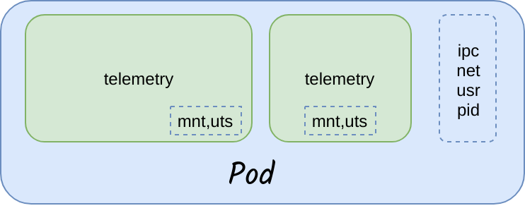
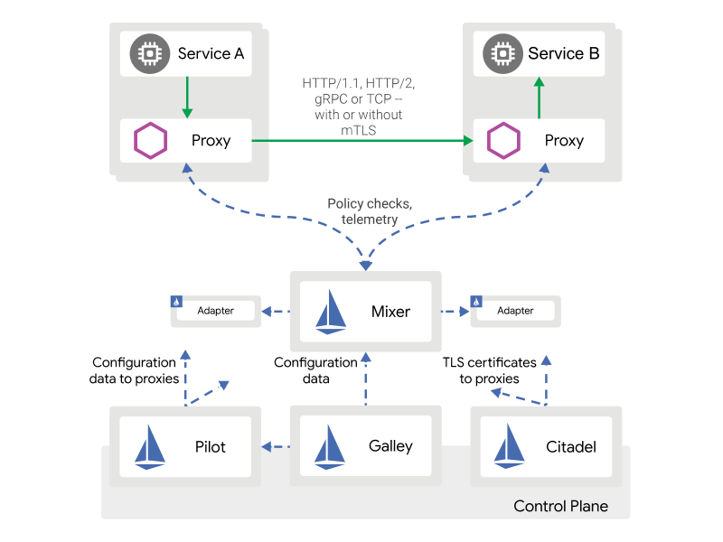

# Istio

### Service Mesh

* The term service mesh is used to describe the network of microservices that make up such applications and the interactions between them.
* As a service mesh grows in size and complexity, it can become harder to understand and manage.
* Its requirements can include discovery, load balancing, failure recovery, metrics, and monitoring.
* A service mesh also often has more complex operational requirements, like A/B testing, canary rollouts, rate limiting, access control, and end-to-end authentication.
*   Usually Service mesh will have one side car container, which intercepts the traffic

    

### What is Istio

* At a high level, Istio helps reduce the complexity of deployments, and eases the strain on your development teams.
* It is a completely open source service mesh that layers transparently onto existing distributed applications.
* It is also a platform, including APIs that let it integrate into any logging platform, or telemetry or policy system.
* Istio’s enables to successfully, and efficiently, run a distributed microservice architecture, and provides a uniform way to secure, connect, and monitor microservices

Benefits/Advantages

* Traffic management
  * Canary, Blue/Green deployment
  * A/B Testing
  * Routing traffic to multiple versions of a service
* Security
  * Traffic Encryption across the services
  * Access control policies
  * Rate limiting to dynamically limit the traffic to a service
  * Denials, whitelists, and blacklists, to restrict access to services
  * Header rewrites and redirect
  * Audit
* Telemetry

### Overhead involved

* Addition hops to access a service
* CPU and Memory consumption of workers for side cars

***

\[\[category.storage-team]] \[\[category.confluence]]
