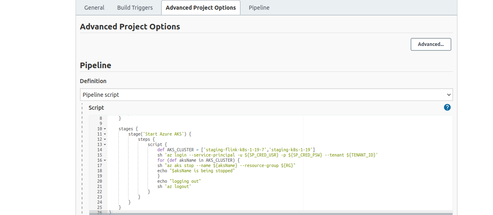

# Jenkins-jobs-to-auto-stop---start-azure-infra-

Jenkins jobs created to stop / start the Azure infra for the following Envs. Jenkins pipeline takes Azure Resource group as input and updates the status of each VM in the resource group to **Deallocation** state.

* ED Dev
* non-ED dev ( devbb)
* VDN dev (dockdev)
* ED Staging
* VDN staging (dockstaging)

The stop jobs are scheduled to run at 9 PM from Monday - Friday. Stop AKS job gets triggered first and

Stop VMs job is set as a downstream Job. Run time of these jobs per env is 5 min approx.

The start jobs are scheduled to run at 8 AM from Monday-Friday. Start VMs job gets triggered first and Start AKS job is set as a downstream Job. Run time of these jobs per env is 20 min approx.

**Jenkins jobs:**

These jobs are created under **OpsAdministration** folder under respective Envs

ED Staging:

* [Stop VMs](http://10.20.0.14:8080/jenkins/job/OpsAdministration/job/staging/job/Core/job/Stop\_Azure\_Vms/)
* [Stop AKS](http://10.20.0.14:8080/jenkins/job/OpsAdministration/job/staging/job/Core/job/Stop\_Azure\_AKS/)
* [Start VMs](http://10.20.0.14:8080/jenkins/job/OpsAdministration/job/staging/job/Core/job/Start\_Azure\_Vms/)
* [Start AKS](http://10.20.0.14:8080/jenkins/job/OpsAdministration/job/staging/job/Core/job/Start\_Azure\_AKS/)

VDN Staging:

* [Stop VMs](http://10.20.0.14:8080/jenkins/job/OpsAdministration/job/DockStaging/job/Core/job/Stop\_Azure\_Vms/)
* [Stop AKS](http://10.20.0.14:8080/jenkins/job/OpsAdministration/job/DockStaging/job/Core/job/Stop\_Azure\_AKS/)
* [Start VMs](http://10.20.0.14:8080/jenkins/job/OpsAdministration/job/DockStaging/job/Core/job/Start\_Azure\_Vms/)
* [Start AKS](http://10.20.0.14:8080/jenkins/job/OpsAdministration/job/DockStaging/job/Core/job/Start\_Azure\_AKS/)

ED Dev:

* [Stop VMs](http://10.20.0.14:8080/jenkins/job/OpsAdministration/job/Dev/job/Core/job/Stop\_Azure\_Vms/)
* [Stop AKS](http://10.20.0.14:8080/jenkins/job/OpsAdministration/job/Dev/job/Core/job/Stop\_Azure\_AKS/)
* [Start VMs](http://10.20.0.14:8080/jenkins/job/OpsAdministration/job/Dev/job/Core/job/Start\_Azure\_Vms/)
* [Start AKS](http://10.20.0.14:8080/jenkins/job/OpsAdministration/job/Dev/job/Core/job/Start\_Azure\_AKS/)

Non ED dev:

* [Stop VMs](http://10.20.0.14:8080/jenkins/job/OpsAdministration/job/devbb/job/Core/job/Stop\_Azure\_Vms/)
* [Stop AKS](http://10.20.0.14:8080/jenkins/job/OpsAdministration/job/devbb/job/Core/job/Stop\_Azure\_AKS/)
* [Start VMs](http://10.20.0.14:8080/jenkins/job/OpsAdministration/job/devbb/job/Core/job/Start\_Azure\_Vms/)
* [Start AKS](http://10.20.0.14:8080/jenkins/job/OpsAdministration/job/devbb/job/Core/job/Start\_Azure\_AKS/)

VDN Dev:

* [Stop VMs](http://10.20.0.14:8080/jenkins/job/OpsAdministration/job/DockDev/job/Core/job/Stop\_Azure\_Vms/)
* [Stop AKS](http://10.20.0.14:8080/jenkins/job/OpsAdministration/job/DockDev/job/Core/job/Stop\_Azure\_AKS/)
* [Start VMs](http://10.20.0.14:8080/jenkins/job/OpsAdministration/job/DockDev/job/Core/job/Start\_Azure\_Vms/)
* [Start AKS](http://10.20.0.14:8080/jenkins/job/OpsAdministration/job/DockDev/job/Core/job/Start\_Azure\_AKS/)

If needed job timings can be updated in the job configuration. Go to the respective Job → Configure → Build Triggers

Currently the pipeline script is as part of the Job itself ( TODO : move to github repo)

Jobs can also be ran on-demand basis by just triggering **Build Now**

**Notes:**

The session information of login is stored in the respective env folder

**ex: AZURE\_CONFIG\_DIR = "/var/lib/jenkins/Azure/Dockstag" ,** we need to make sure no other jobs uses the same config dir as it will conflict with session and the job will fail.

***

\[\[category.storage-team]] \[\[category.confluence]]
