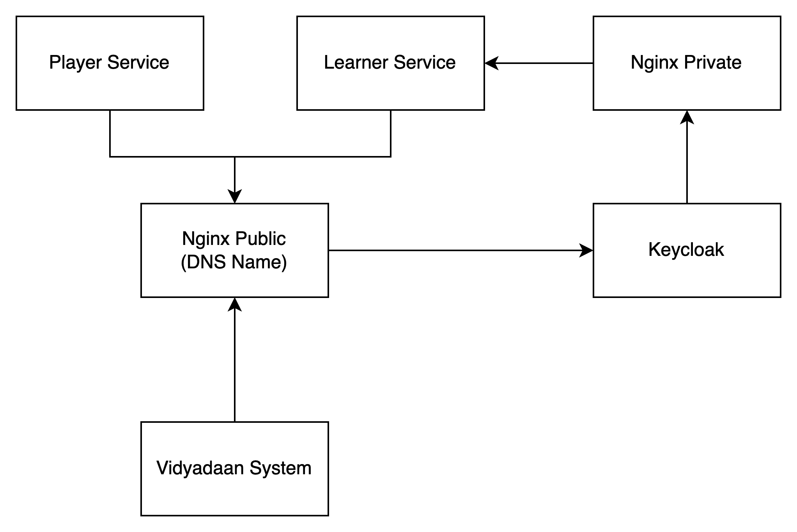
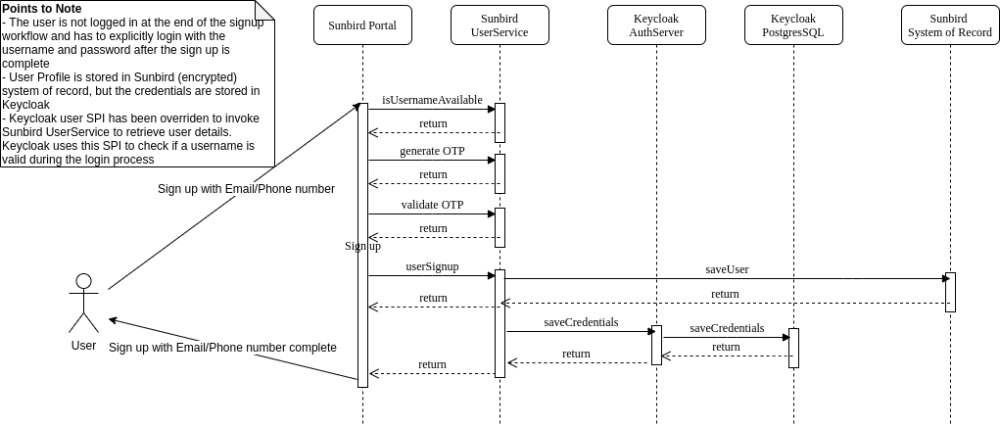

# Keycloak-on-Sunbird

**Introduction**

* We are using the open source Keycloak 7.0.1 version. To know more about Keycloak and its features, read here - [https://www.keycloak.org/documentation](https://www.keycloak.org/documentation)
* Keycloak is used as an authentication system on Sunbird
* Sunbird has used SPI (service provider interface) to customise login, registration, forgot password workflows and federated user provider
* Sunbird has also customised the look and feel by adding Keycloak themes and email templates

#### High level architecture depicting the components connected to Keycloak

* Only a handful of services connect to Keycloak
* Only nginx public has been allowed and configured to connect to keycloak is the traffic originates from outside VPC
* Portal, learner service and Vidydaan system connect to Keycloak via nginx public using the domain name
* Keycloak connects to learner service via nginx private ingress

#### Provision, bootstrap , build, configuration and deploy instructions

* Refer the the ED microsite and private repo template files for the Keycloak related jobs, variables and configurations
* Provision - [https://github.com/project-sunbird/sunbird-devops/tree/master/ansible/roles/keycloak-provision](https://github.com/project-sunbird/sunbird-devops/tree/master/ansible/roles/keycloak-provision)
* Deploy and Bootstrap - [https://github.com/project-sunbird/sunbird-devops/tree/master/ansible/roles/keycloak-deploy](https://github.com/project-sunbird/sunbird-devops/tree/master/ansible/roles/keycloak-deploy)
* These are the list of jobs related to Keycloak. What each of this job does is already docuements in the ED microsite next to the job names.
  * Build/Core/Keycloak
  * ArtificatUpload/Core/Keycloak
  * Provision/Core/Keycloak
  * Deploy/Kubernetes/KeycloakRealm
  * Deploy/Kubernetes/Keycloak
* Take a look at the relevant jenkins jobs and ansible roles to understand what each job / roles does
* Configuration file which has configuration on connection to DB and clustering - [https://github.com/project-sunbird/sunbird-devops/blob/master/ansible/roles/keycloak-deploy/templates/standalone-ha.xml](https://github.com/project-sunbird/sunbird-devops/blob/master/ansible/roles/keycloak-deploy/templates/standalone-ha.xml)

#### Custom changes done by Sunbird

* SPI changes - [https://github.com/Sunbird-Lern/sunbird-auth](https://github.com/Sunbird-Lern/sunbird-auth)
* Themes and email templates - [https://github.com/project-sunbird/sunbird-devops/tree/master/ansible/artifacts/sunbird](https://github.com/project-sunbird/sunbird-devops/tree/master/ansible/artifacts/sunbird)
* Cassandra federation - [https://github.com/Sunbird-Lern/sunbird-auth/tree/release-3.8.0](https://github.com/Sunbird-Lern/sunbird-auth/tree/release-3.8.0)

#### Realm Settings and configurations

* Keycloak realm configurations docs -[https://www.keycloak.org/docs/latest/server\_admin/#configuring-realms](https://www.keycloak.org/docs/latest/server\_admin/#configuring-realms)
* Sunbird realm - [https://github.com/project-sunbird/sunbird-devops/blob/master/ansible/roles/keycloak-deploy/templates/keycloak-realm.j2](https://github.com/project-sunbird/sunbird-devops/blob/master/ansible/roles/keycloak-deploy/templates/keycloak-realm.j2)
* Onboard the sunbird realm onto keycloak using the **Deploy/Kubernetes/KeycloakRealm** jenkins job
* Visit the keycloak admin console and take a look at the realm configurations which come as default, clients etc.
* Feel free to change any of the realm parameters as per your policy, for example the validity of an access token can be 1 hour or 30 days or something else depending on your need

#### Federation setup with Cassandra

* This comes already pre installed as per the the realm setup when you run **Deploy/Kubernetes/KeycloakRealm** jenkins job
* The federation provider is used to connect to learner service and fetch the user data from cassandra
* For more details on federation and code, reach out to [https://github.com/Sunbird-Lern](https://github.com/Sunbird-Lern) community

#### Login, Signup, Forgot password flows

* These are standard workflows similar to any website
* You can use phone number / email to signup or login or reset password
* All these flows use the SPI code and connect to learner service
* Signup flow connects to learner service and creates the user in cassandra and sets the password on keycloak database
* Login flow connects to learner service and fetches the user data from cassandra and validates the password from keycloak database
* For password flow connects to learner service and fetches the user data from cassandra and resets the password on keycloak database
* For more details on these flows and intricate details of API and code functionality, reach out to [https://github.com/Sunbird-Lern](https://github.com/Sunbird-Lern) community

#### User sessions

* User sessions are stored in keycloak hep memory
* The sessions can be viewed on the keycloak admin page under users page or on the client page
* Sessions get auto expired on logout or on validity end time
* The access token validity configuration for the realm decides the validity end time

#### Operations and Maintenance

Scaling up

* Create the VM
* Add the IP in the inventory groups \[keycloak-{1-9}] and keycloak - [https://github.com/project-sunbird/sunbird-devops/blob/master/private\_repo/ansible/inventory/dev/Core/hosts#L6-L10](https://github.com/project-sunbird/sunbird-devops/blob/master/private\_repo/ansible/inventory/dev/Core/hosts#L6-L10)
* Run the **Deploy/Kubernetes/Keycloak** jenkins job
* Add the new VM to the load balancer backend pool

Scaling down

* Remove the VM to the load balancer backend pool
* Stop the keycloak process on the the node manually
* Remove the IP from the inventory groups \[keycloak-{1-9}] and keycloak - [https://github.com/project-sunbird/sunbird-devops/blob/master/private\_repo/ansible/inventory/dev/Core/hosts#L6-L10](https://github.com/project-sunbird/sunbird-devops/blob/master/private\_repo/ansible/inventory/dev/Core/hosts#L6-L10)
* Run the **Deploy/Kubernetes/Keycloak** jenkins job
* Delete the VM

Upgrade

* Upgrade the keycloak package to use newer version in the build step - [https://github.com/Sunbird-Lern/sunbird-auth/blob/release-3.8.0/keycloak/scripts/pipelines/sunbird-auth-build/Jenkinsfile#L21](https://github.com/Sunbird-Lern/sunbird-auth/blob/release-3.8.0/keycloak/scripts/pipelines/sunbird-auth-build/Jenkinsfile#L21)
* Upgrade the keyclaok libraries on the dependent services
  * Portal service
  * Learner service
* Update the themes, email templates, realm, db connection and clustering configuration files as per new version format
* Deploy keycloak and test all workflows
* For more information on upgrades, refer to these links to get an idea on the complexity and issues that can occur during an upgrade
  * \[\[KeyCloak 6.0.1 upgrade|KeyCloak-6.0.1-upgrade]]
  * \[\[Keycloak Upgrade from 3.2.0-Final to 6.0.1|Keycloak-Upgrade-from-3.2.0-Final-to-6.0.1]]
  * \[\[Keycloak Upgrade from 3.2.0 to 7.0.1|Keycloak-Upgrade-from-3.2.0-to-7.0.1]]
* For more details on the upgrade process and dependencies, reach out to [https://github.com/Sunbird-Lern](https://github.com/Sunbird-Lern) community and [https://github.com/Sunbird-Ed/](https://github.com/Sunbird-Ed/) community

Known issues

* There are no known issues with respect to Keycloak after the package was upgraded to 7.0.1

## Sunbird Auth Architecture

**Current Authentication Architecture** Attached are some diagrams that depict the current authentication architecture

**Email/Phone number based sign up and sign in** .png>)

**Google based sign in** .png>)

**State sso sign in** .png>)

**Mobile refresh token workflow**

1. The portal does not use the refresh tokens to get new access tokens.
2. The mobile app saves the refresh token and uses it to get a new access token once the existing access token expires
3. The app leverages the same portal flows above, but has a URL parameter indicating that is mobile. The workflows above (implemented on portal) route to a mobile specific url at the end of the process. The mobile app listens on these specific URLs and gets access to the refresh and access token as mentioned below.
   * In email/phone sign in, the app gets redirected to /oauth2callback?code={code}. It invokes a keycloak endpoint (/auth/realms/sunbird/protocol/openid-connect/token) to exchange the code to get the tokens
   * In the state SSO sign in, the app gets redirected to /sso/sign-in/success?id={id}. It invokes a portal endpoint (/v1/sso/create/session?id={extracted\[‘id’]}) to exchange the ID to get the tokens
   * In the google sign in workflow, the app gets the tokens directly as query params

\*\*      \*\*

.png>)

***

\[\[category.storage-team]] \[\[category.confluence]]
