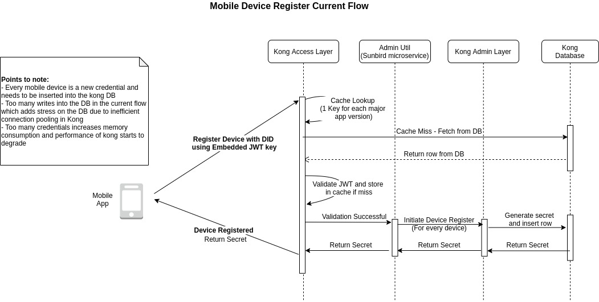
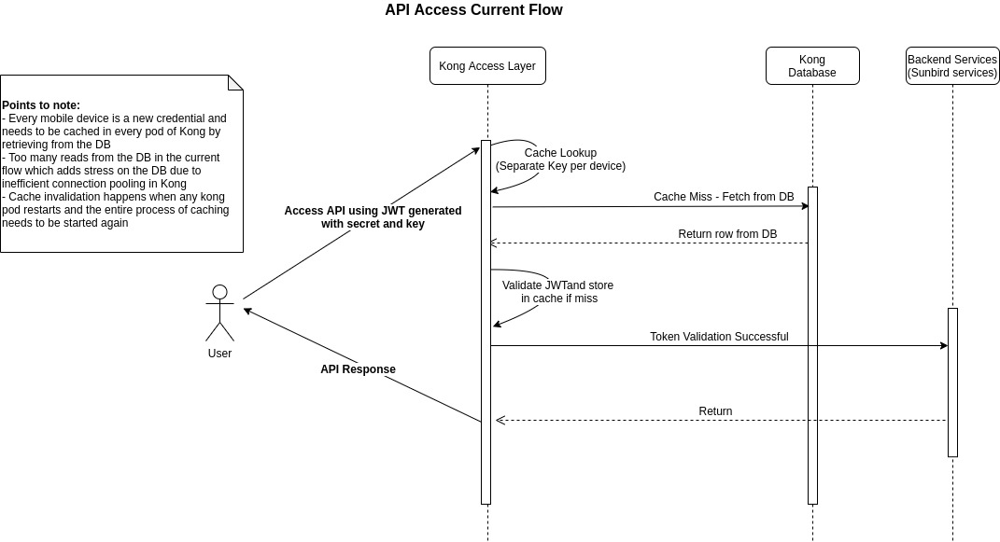
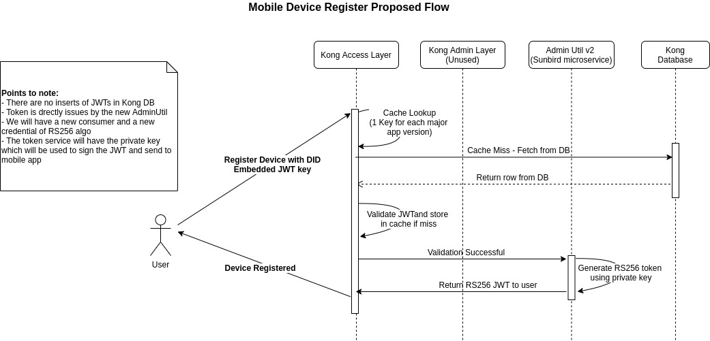
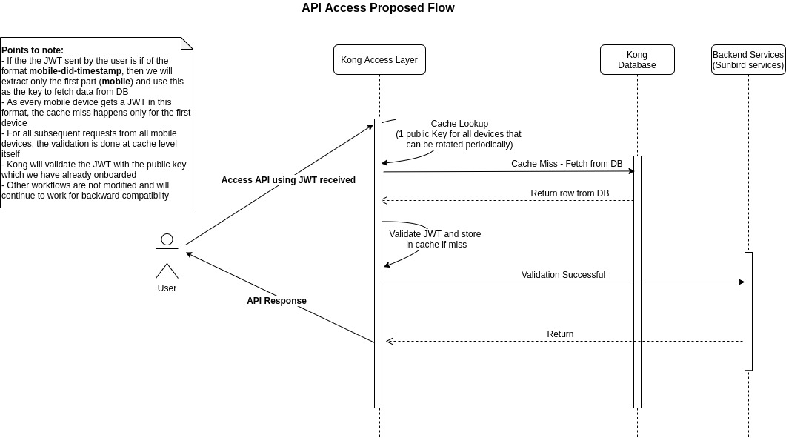

# Kong-JWT-Tokens-Design-Proposal

#### Pre-requisite Info

* HS256 uses a symmetric key (secret) to generate and validate the tokens
* RS256 uses a private key to generate the token and public key to validate the token
* Kong supports both these algos.
* Kong allows us to have consumers and multiple credentials under a consumer. Each credential has a unique key and secret. In Sunbird, the key for mobile credentials is the device id and the secret is generated by Kong

#### Current Design

 

* Mobile\_device is a consumer (in Kong) and each mobile device is a credential (unique identity - key and secret) under this consumer.
* Mobile app is embedded with a JWT token which can only be used to invoke the device register api. The device register api will register a new credential under the mobile\_device consumer.
* Mobile app sends a request to register the device with KEY being the device id
* Kong generates a secret for this key and inserts into db as a new credential. Kong also sends the secret to mobile app. The key (device ID) is the unique identity for the Kong credential.
* With the secret received, mobile app will generate a new JWT (HS256) which will have access to API’s in sunbird
* Each device is a new credential entry in kong DB
* Current jwts in prod - 12 M (\~ number of app installs)

**Limitations with current design**

* Each pod of Kong needs to fetch the data from DB for the first time and cache it
* If a pod restarts, cache of all the pods in the cluster is invalidated
* Too many jwts causes scaling issues in kong as each jwt needs to be cached and the memory consumed increases as jwts are cached
* Also Kong does not handle connection pooling efficiently due to which postgres db encounters stress and performance of postgres starts to degarde
* As the cache memory increases, kong performance starts to degrade
* Also kong is unable to support more than 20 credential registrations a second

#### Proposed Design

 

* Mobile app is embedded with a JWT token which can invoke only device register api
* Mobile app sends a request to register the device with KEY being the device id
* The signing service (new service replacing mobile device register API) will create a jwt token (RS256) of the format **mobilev2-deviceid-timestamp** and sends it back to the mobile app
* Mobile app can use the token received to communicate with API’s in sunbird

Changes required in Kong JWT plugin

* We will onboard a new mobile consumer and credential ( **mobilev2)** with the public key set for token verification. The corresponding private key would be part of the signing service.
* In the existing kong plugin the issuer value in the incoming jwt token is assumed to be the credential id. The issuer value is used to validate the token (with each issuer having a unique secret stored in DB) and the rate limiting also applies to each issuer.
* When a request from the mobile app comes to the plugin, we will check if the jwt issuer has our new format **mobilev2-deviceid-timestamp** . If it does not, we allow Kong to continue with the usual processing. This is for backward compatability for older mobile app versions.
* If the jwt matches our new format, we will strip off the **deviceid** and **timestamp** and use only the first part **mobilev2** to retrieve the public key and verify the token. However the full issuer **mobilev2-deviceid-timestamp** will be used for the rate limiting.
* With this, all kong instances only need to cache one key mobilev2 (public key) to validate all mobile tokens issued going forward.
* All new mobile app installs/updates will re-register for a new key which is of RS256 algorithm

**Benefits**

* Single jwt token and easy to cache in all pods of kong
* Even if a pod restarts and cache is invalidiated, kong needs to cache just one jwt token for all mobile devices
* We wont have millions of jwts
* Low memory consumption
* Backward compatible - Older apps can continue to use HS256 jwt tokens for the next 6 months or so after which we will decommission that consumer and all credentials under that consumer.
* Although we are applying this change on .10 version of Kong and we have to eventually upgrade to 2.0, the jwt plugin changes are compatible with Kong 2.0 as well and will not need custom development along with the upgrade.

***

\[\[category.storage-team]] \[\[category.confluence]]
