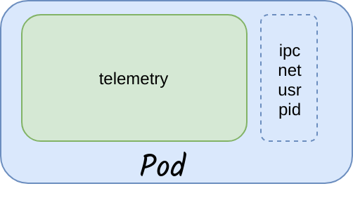
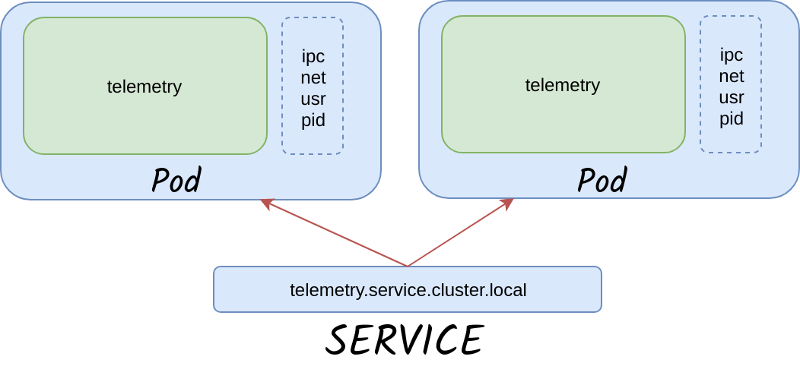
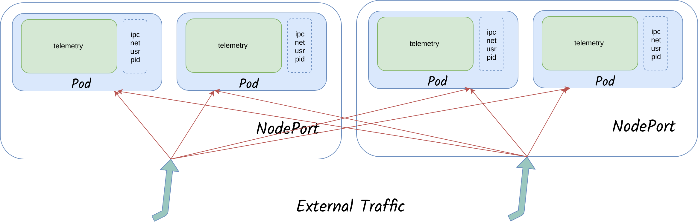
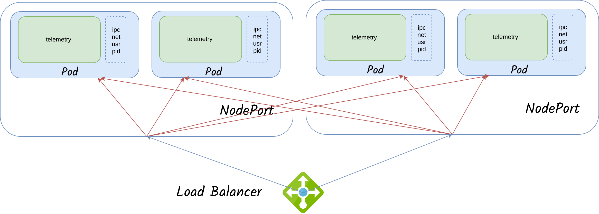
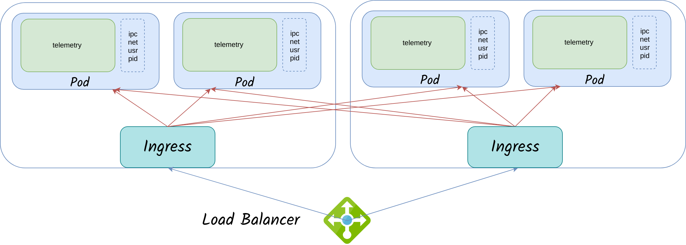

# Kubernetes

**1. Kubernetes Architecture**            

**2. Basic Objects**

*   **POD** A _Pod_ is the basic execution unit of a Kubernetes application–the smallest and simplest unit in the Kubernetes object model that you create or deploy. A Pod represents processes running on your Cluster.

    
* **Service** In Kubernetes, a Service is an abstraction which defines a logical set of Pods and a policy by which to access them (sometimes this pattern is called a micro-service).
*   **Volume** Kubernetes volume, has an explicit lifetime - the same as the Pod that encloses it. Consequently, a volume outlives any Containers that run within the Pod, and data is preserved across Container restarts. Of course, when a Pod ceases to exist, the volume will cease to exist, too

    If In need, can stateful Volumes, which will be persistent, even after the deployment got deleted.

    At its core, a volume is just a directory, possibly with some data in it, which is accessible to the Containers in a Pod.
*   **Namespaces** Namespaces are abstraction or sandboxed environmentsNames of resources need to be unique within a namespace, but not across namespaces.

    Namespaces can not be nested inside one another and each Kubernetes resource can only be in one namespace

**3. Types of Service** **1.NodePort**



**2.LoadBalancer**



**3.Ingress**



### Code Example for a deployment

```
---
apiVersion: apps/v1
kind: Deployment
metadata:
  name: telemetry
  namespace: exp
spec:
  replicas: 1
  selector:
    matchLabels:
      app: telemetry
  template:
    metadata:
      labels:
        app: telemetry
    spec:
      imagePullSecrets:
        - name: sunbird
      containers:
        - name: telemetry
          image: ntphub.azurecr.io/telemetry-service:release-2.1.1_RC1
          imagePullPolicy: Always
          resources:
            requests:
              cpu: 100m
              memory: 200Mi
          ports:
            - containerPort: 5000
          envFrom:
            - configMapRef:
                name: telemetry-config
---
apiVersion: v1
kind: Service
metadata:
  name: telemetry-service
  namespace: exp
spec:
  ports:
  - port: 5000
    targetPort: 5000
  selector:
    app: telemetry


```


**4. Deploying new versions without downtime** Kubernetes allows the containers to be updated without downtime. When we send a deploy request to K8s, it will bring up new containers with the requested version and for every new container(configurable) that is live and handling requests, it purges an old container and overtime the cluster will only have the newer version. Rollback is also allowed if there are errors after the new deployment.&#x20;

The following best practices have to be implemented to allow for this feature to work without dropping requests

&#x20;1\. The following snippet should be part of the deployment yaml file. This allows to control the number of new containers and the old container purge count.

```
strategy: 
   rollingUpdate: 
     maxSurge: 1
     maxUnavailable: 0 
   type: RollingUpdate
```

&#x20;2\. The following snippet should be part of the deployment yaml file. This allows us to configure the endpoints that K8s can use to detect that a new container is ready for use.

```
        livenessProbe:      
         httpGet: 
           path: /service/live 
           port: 8080  
           scheme: HTTP 
         initialDelaySeconds: 15   
         periodSeconds: 2 
         successThreshold: 1 
         timeoutSeconds: 3 
       readinessProbe: 
         httpGet: 
           path: /service/ready 
           port: 8080 
           scheme: HTTP 
         initialDelaySeconds: 15   
         periodSeconds: 2 
         successThreshold: 1 
         timeoutSeconds: 3
```

&#x20;3\. The application should handle SIGTERM requests and delay shutdown (Thread.sleep or JS equivalent) for some duration - ideally 30 seconds. This gives enough time for the container (being purged) to complete all requests        that it was already processing. The container would stop getting new requests once the SIGTERM is sent to it.

**5. AutoScaling**

* At load Application should scale inside the cluster(HPA) and, in need, should create a node and expand the K8s cluster(CA- Cluster AutoScaling).
* HPA ( Horizondal pod autoscaling)

```
---
apiVersion: autoscaling/v1
kind: HorizontalPodAutoscaler
metadata:
  name: telemetry
spec:
  scaleTargetRef:
    apiVersion: apps/v1
    kind: Deployment
    name: content
  minReplicas: 1
  maxReplicas: 10
  targetCPUUtilizationPercentage: 70
```

* Cluster Auto Scaling
* Sample response bench-marking

***

\[\[category.storage-team]] \[\[category.confluence]]
