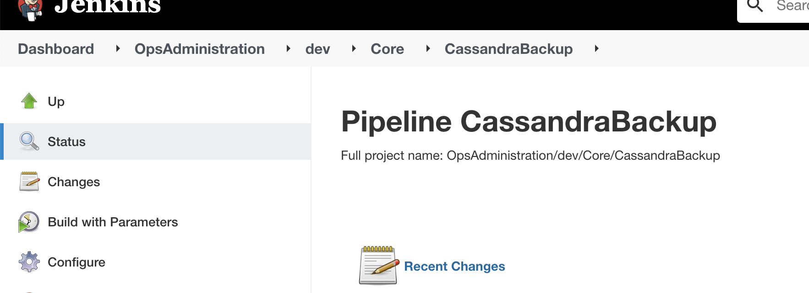
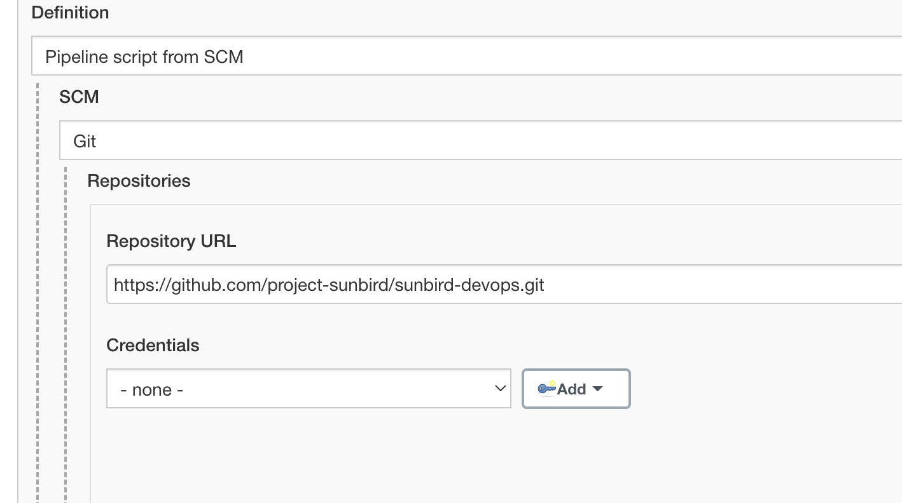
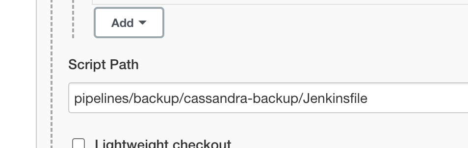
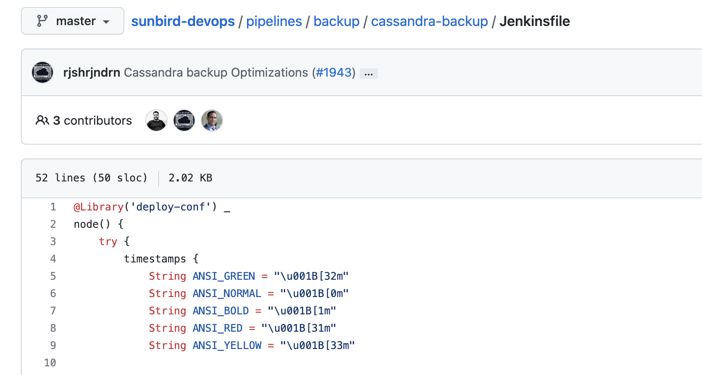
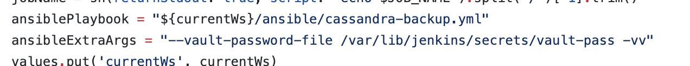
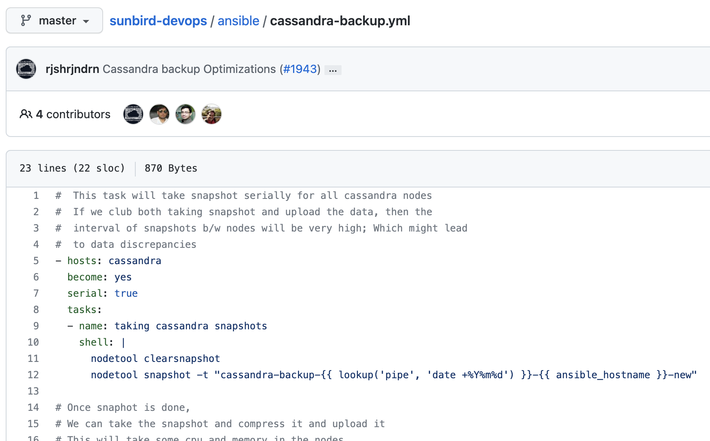
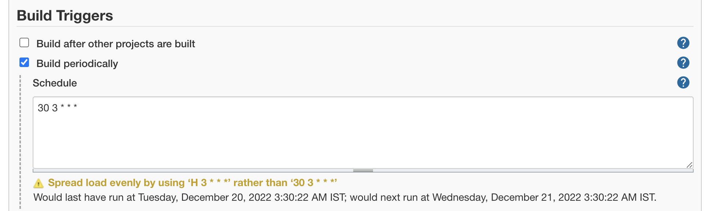

# OpsAdministration-Jenkins-Jobs

OpsAdministration jenkins jobs are used mainly for operations such as database backup, creating new users to provide ssh access etc.

These jobs are split into three folders - Core, KP and DP. This is same as the structure of other jobs. They also work similar to other set of jobs.

The jobs are quite simple and do what the name implies and are self explanatory. For example, a job named CassandraBackup performs the data backup cassandra database.

The working of these jobs are also exactly similar to other jobs - There is a Jenkinsfile and a ansible role for each of these.

For more information on the Jenkinsfile and ansible roles, refer to the pipeline and playbook code. Few images below on how to check this -

* Go to the job

* Click on configure and find the repo and Jenkinsfile

 

* Go to repo and find the jenkinsfile and ansible playbook

 

* Check the ansible playbook to understand what it does

You can use any latest tag or branch to run these jobs. We recommend running the backup jobs from the following tag - [https://github.com/project-sunbird/sunbird-devops/tree/tag-for-backups](https://github.com/project-sunbird/sunbird-devops/tree/tag-for-backups)

You will also find similar backup tag in other repositories [https://github.com/project-sunbird/sunbird-learning-platform/tree/tag-for-backups](https://github.com/project-sunbird/sunbird-learning-platform/tree/tag-for-backups) and [https://github.com/Sunbird-Obsrv/sunbird-data-pipeline/tree/tag-for-backups](https://github.com/Sunbird-Obsrv/sunbird-data-pipeline/tree/tag-for-backups)

The backup jobs are run with a cronjob option on jenkins so that automated backups happen on a daily basis or based on the schedule. These can be modified as per need.

There are other set of jobs which are used as part of a release. For example, GraylogMongoImport job will add new dashboards, alerts etc into graylog. These will be run as part of a release with the release tags.

Below is a one liner description for each of these jobs

| **Core Directory Jobs**         | **What it does?**                                 |
| ------------------------------- | ------------------------------------------------- |
| ApplicationElasticsearchBackup  | Takes application elasticsearch cluster backup    |
| ApplicationElasticsearchRestore | Restores from application elasticsearch backup    |
| Bootstrap                       | Installs initial set of packages on a new VM      |
| CassandraBackup                 | Takes cassandra backup                            |
| ClearDockerImages               | Clears all existing docker images from jenkins vm |
| ClearWorkspace                  | Clears workspace from jenkins vm                  |
| CreateUser                      | Creates new user on an ansible vm group           |
| GrafanaBackup                   | Takes grafana backup                              |
| GraylogGeoIP                    | Initializes geo ip db on graylog nodes            |
| GraylogMongoDbBackup            | Takes backup of mongo db from graylog nodes       |
| GraylogMongoImport              | Imports data into mongo db on graylog nodes       |
| JenkinsBackup                   | Takes jenkins backup                              |
| KeyRotation                     | Rotates ssh key on vms                            |
| KongMigration                   | Performs migration of kong db                     |
| Log4jFix                        | Performs fixes for log4j vulnerabilities          |
| LoggerElasticSearchBackup       | Takes log elasticsearch cluster backup            |
| LoggerElasticSearchRestore      | Restores from log elasticsearch backup            |
| ManagedPostgresBackup           | Takes back up of managed postgres database        |
| MongoDbBackup                   | Takes back up of mongodb                          |
| MongoRestore                    | Restores from mongodb backup                      |
| MonitDeploy                     | Deploy monit onto vms                             |
| MonitStatus                     | Checks monit status from vms                      |
| PostInstallScript               | Perfroms sunbird post install steps               |
| PostgresqlBackup                | Takes back up of postgres db                      |
| PostgresqlMigration             | Perform postgresql migration                      |
| PostgresqlRestore               | Restores from postgres backup                     |
| PrometheusBackup                | Takes back up of prometheus db                    |
| PrometheusSanpshot              | Takes snapshot of prometheus db                   |
| RedisBackup                     | Takes back up of redis db                         |
| ml-mongo-dump                   | Dumps the data from managed learn mongo           |

| **KnowledgePlatform Directory Jobs** | **What it does?**                            |
| ------------------------------------ | -------------------------------------------- |
| Bootstrap                            | Installs initial set of packages on a new VM |
| CassandraBackup                      | Takes cassandra backup                       |
| CassandraRestore                     | Restores from cassandra backup               |
| CreateUser                           | Creates new user on an ansible vm group      |
| ElasticsearchBackup                  | Takes composite elasticsearch cluster backup |
| ElasticsearchRestore                 | Restores from composite elasticsearch backup |
| KeyRotation                          | Rotates ssh key on vms                       |
| Log4jFix                             | Performs fixes for log4j vulnerabilities     |
| MonitDeploy                          | Deploy monit onto vms                        |
| MonitStatus                          | Checks monit status from vms                 |
| Neo4jBackup                          | Takes neo4j cluster backup                   |
| Neo4jRestore                         | Restores from neo4j backup                   |
| RedisBackup                          | Takes back up of redis db                    |
| RedisRetore                          | Restores from redis backup                   |

| **KnowledgePlatform Directory Jobs** | **What it does?**                                |
| ------------------------------------ | ------------------------------------------------ |
| Bootstrap                            | Installs initial set of packages on a new VM     |
| CassandraBackup                      | Takes cassandra backup                           |
| CassandraRestore                     | Restores from cassandra backup                   |
| ConsumerLagAlert                     | Provides info about current lag from consumers   |
| CreateUser                           | Creates new user on an ansible vm group          |
| DataproductsAlert                    | Alerts on failure of data products job           |
| DruidPostgresBackup                  | Takes back up of druid postgres db               |
| ElasticsearchBackup                  | Takes telemetry elasticsearch cluster backup     |
| ElasticsearchRestore                 | Restores from telemetry elasticsearch backup     |
| InfluxDBBackup                       | Takes back up of influx db                       |
| InfluxdbRestore                      | Restores from influx db backup                   |
| KeyRotation                          | Rotates ssh key on vms                           |
| Log4jFix                             | Performs fixes for log4j vulnerabilities         |
| MonitDeploy                          | Deploy monit onto vms                            |
| PostgresqlBackup                     | Takes back up of postgres db                     |
| PostgresqlRestore                    | Restores from postgres backup                    |
| RedisBackup                          | Takes back up of redis db                        |
| RedisDumpMonitoring                  | Alerts if redis db dump fails                    |
| RedisRestore                         | Restores from redis backup                       |
| RestartSecorJobs                     | Restarts secor jobs                              |
| SamzaJobsAlert                       | Alerts in case of samza job failures             |
| SamzaJobsAlertProvision              | Deploys the alerting scripts in samza vms        |
| SamzaJobsKill                        | Kills samza jobs                                 |
| SamzaLogsBackup                      | Backs up samza logs                              |
| SamzaMonitoringProvision             | Deploys the monitoring scripts in samza vms      |
| SamzaOrphanprocessAlert              | Alerts on orphan samza processes                 |
| SamzaThroughputAlert                 | Alerts if events are 0 or not getting processed  |
| SamzaThroughputProvision             | Deploys the throughput alert script in samza vms |

***

\[\[category.storage-team]] \[\[category.confluence]]
