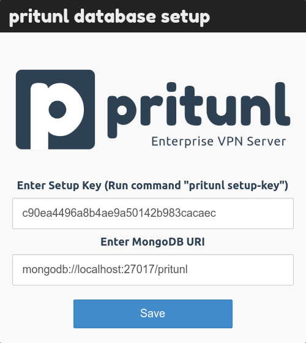
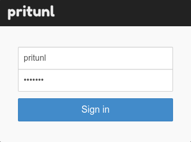
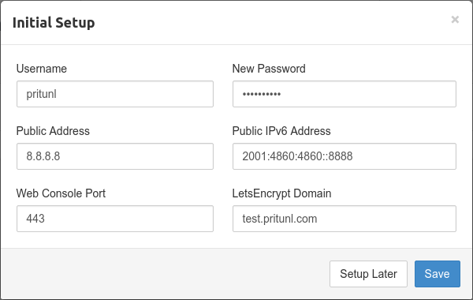
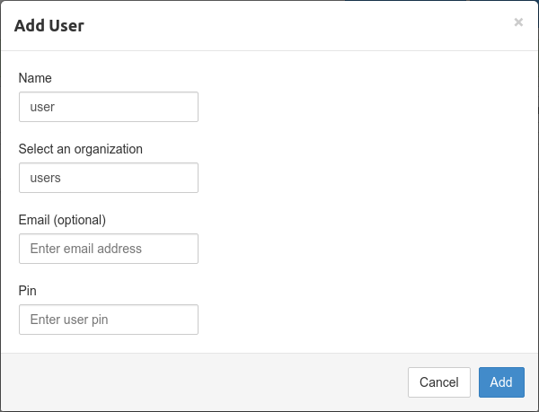
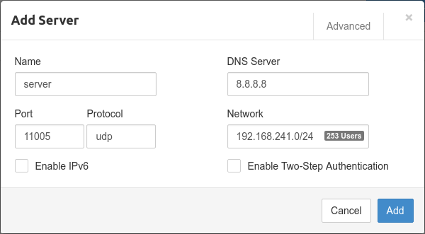
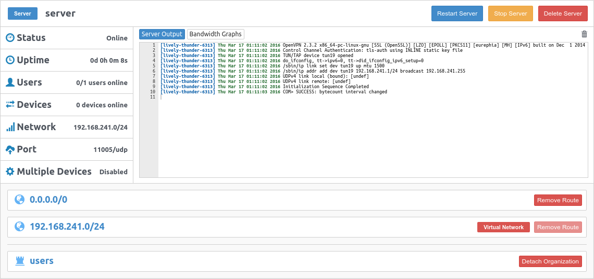
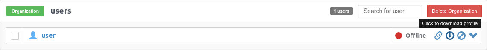
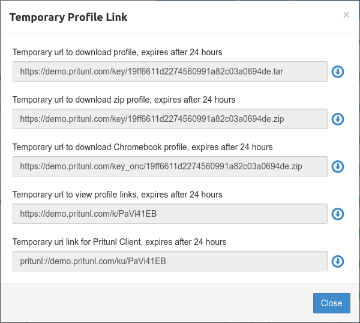

# Pritunl-Setup-and-Configuration

**Infra Provision:**

* Create VM with configuration 2cpu and 4gb memory

**Install Pritunl:**

Below steps is to install pritunl on ubuntu 22.04:

* sudo tee /etc/apt/sources.list.d/pritunl.list << EOF deb http://repo.pritunl.com/stable/apt jammy main EOF
* sudo apt-key adv --keyserver hkp://keyserver.ubuntu.com --recv 7568D9BB55FF9E5287D586017AE645C0CF8E292A #Import signing key from keyserver
* curl https://raw.githubusercontent.com/pritunl/pgp/master/pritunl\_repo\_pub.asc | sudo apt-key add -
* sudo tee /etc/apt/sources.list.d/mongodb-org-6.0.list << EOF deb https://repo.mongodb.org/apt/ubuntu jammy/mongodb-org/6.0 multiverse EOF
* wget -qO - https://www.mongodb.org/static/pgp/server-6.0.asc | sudo apt-key add -
* sudo apt update
* sudo apt --assume-yes upgrade
* sudo apt -y install wireguard wireguard-tools
* sudo ufw disable
* sudo apt -y install pritunl mongodb-org
* sudo systemctl enable mongod pritunl
* sudo systemctl start mongod pritunl

**Configure Pritunl:**

Increase Open File Limit

Run the commands below to increase the open file limit on the server. This will prevent connections issues on servers with high load. This should also be done on the MongoDB server. Use the command sudo lsof -p pgrep pritunl-web | wc -l to check the file count for the Pritunl web server.

```
sudo sh -c 'echo "* hard nofile 64000" >> /etc/security/limits.conf'
sudo sh -c 'echo "* soft nofile 64000" >> /etc/security/limits.conf'
sudo sh -c 'echo "root hard nofile 64000" >> /etc/security/limits.conf'
sudo sh -c 'echo "root soft nofile 64000" >> /etc/security/limits.conf'
```

Database Setup

When Pritunl starts for the first time a database setup prompt will be shown on the web server running on port 443. The database setup will prompt for a setup key and MongoDB URI. To get the setup key ssh on to the server and run the command sudo pritunl setup-key this will return the setup key. By default the MongoDB URI will be filled with the URI for the localhost MongoDB server. This should be left as it is when the MongoDB server is running on the same server as the Pritunl instance. For Enterprise clusters refer to the MongoDB documentation for Connection String URI Format. Alternatively this can be set directly in the /etc/pritunl.conf file or using the cli command. More information on the cli command can be found in the Commands sections. Some MongoDB servers authenticate on the admin database and require the option authSource=admin to be included in the URI.

 Initial Setup

After the MongoDB database uri has been configured the web console will display the login dialog. The default username is pritunl, run sudo pritunl default-password to get the default password. After signing in the initial setup dialog will be shown. This will allow changing the username and password. The Pritunl servers public address will be automatically detected and should not need to be changed. For generating a signed SSL certificate refer to the LetsEncrypt SSL Certificate section.





**Connecting:**

Creating Organization and User

To create an organization click Add Organization from the Organization page in the web console. Then click Add User an email address and user pin can optionally be included.

Creating Server

Once the organization and user have been created go to the Servers page and click Add Server. By default a random udp port and random vpn network will be selected. The network should not conflict with a local network on your client computer and also be large enough for all users that will be attached to the server. The dns server will automatically be set to Google's public dns server. Once the server is created click Attach Organization to and attach the organization created earlier to the server. Then click Start Server to start the vpn server.





Once the VPN is setup, to connect to any other server like Jenkins through VPN, you need to have peering done between VPN network and the destination server network and configure the server route from the VPN console.

Configuring Server Routes

Server routes control what traffic will be tunneled over the vpn server. By default a server will include the 0.0.0.0/0 route. This route will tunnel all internet traffic over the vpn server. To only route a local network on the vpn server first remove the 0.0.0.0/0 route and click Add Route to add the local network route such as 192.168.0.0/24.

Downloading User Profile

After the server has been created the user profile can be downloaded on the Users page by clicking the download button or profile links button on the right side of a user. The profile can then be imported into the Pritunl client or any other OpenVPN client.

User Profile Links

Profile links allow downloading user profiles in different formats using temporary links. The uri link can be used to import the profile directly from the Pritunl client.



**Pritunl Client Configuration:**

Go throw the video attached for connecting client.

Below is the link to read more about client configuration and connecting to pritunl vpn:

[https://client.pritunl.com/](https://client.pritunl.com/)

***

\[\[category.storage-team]] \[\[category.confluence]]
