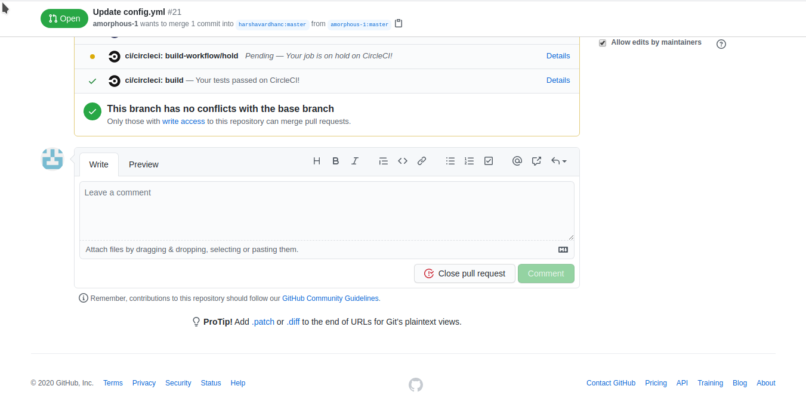
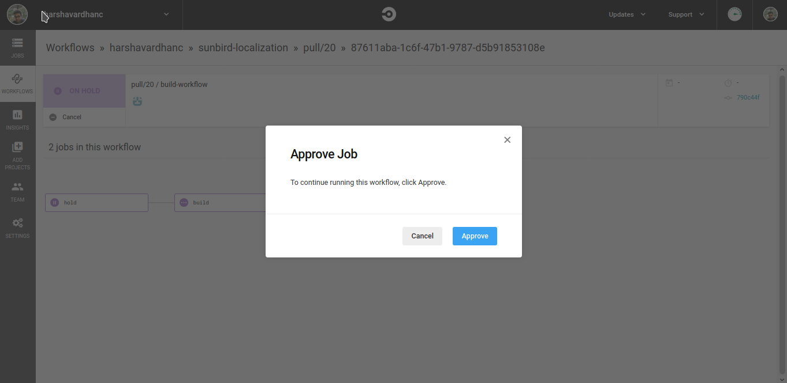
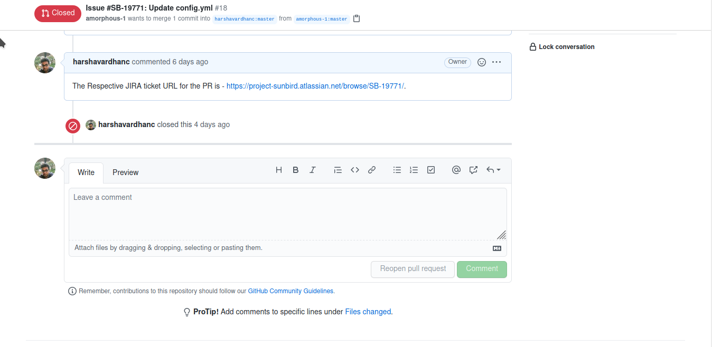

# Triggering-CI-based-on-approval-for-PR

**Problem statement:**

Currently, for every pull request, there will be CircleCI and Sonarcloud check for all the repositories.For CircleCI build, we are passing few secrets (encrypted) like sonar token and npm token. This secret can be viewed by updating the CircleCI steps(using echo/cat command).

**Solution:**

Approval based CI trigger for a pull request:

By adding this approval based trigger reviewer can make sure that there is no such configuration changes that expose the secrets and approve the CI build.

*   Using manual job approval in CircleCI:

    ```
       In CircleCI itself we can set manual approval for a job. Workflows can be configured to wait for manual approval of a job before continuing to the next job. Anyone who has to push access to the repository can click the Approval button to continue the workflow.
    ```





To achieve this we have to update the CircleCI config file. Below is the sample config file.

```
version: 2.1
jobs:
  hold:
    docker:
      - image: circleci/node:12
    steps:
      - run: printf "A hold job to wait for a manual approval"
  build:
    working_directory: ~/project
    docker:
      - image: circleci/node:12 
    steps:
      - checkout
      - run: npm install
   
      - run:
          name: Publish to NPM
          command: |
            if [ -z $CIRCLE_PR_NUMBER ]; then 
              npm set //registry.npmjs.org/:_authToken=$NPM_TOKEN
              npm publish ~/project 
            else
              echo "Nothing to publish!" 
            fi
      - run:
          name: comment jira id
          command: |
             ticket=$(curl -XGET https://api.github.com/repos/$CIRCLE_PROJECT_USERNAME/$CIRCLE_PROJECT_REPONAME/pulls/$CIRCLE_PR_NUMBER | jq .title -r | awk -F ' ' '{print $2}' | sed 's/\#//g' | sed 's/\://'g)
             curl \
              -X POST \
              -u $OAUTH_TOKEN:x-oauth-basic \
              -d '{"body": "The Respective JIRA ticket URL for the PR is - https://project-sunbird.atlassian.net/browse/'"$ticket"/'."}' \
                     https://api.github.com/repos/$CIRCLE_PROJECT_USERNAME/$CIRCLE_PROJECT_REPONAME/issues/$CIRCLE_PR_NUMBER/comments
workflows:
  version: 2
  build-workflow:
    jobs:
      - hold:
          type: approval
      - build:
          requires:
            - hold
```

**Commenting back the Jira URL in the pull request.**

As part of the last step in the CircleCI build, we can comment by constructing the respective Jira ticket URL so that anyone can just click on the URL and see the respective Jira ticket. This can be achieved by using conventional commit message format.



*   **Commenting on the pull request to approve the CI.**

    Triggering the CircleCI build just be commenting on the pull request with specified commands/words.

***

\[\[category.storage-team]] \[\[category.confluence]]
