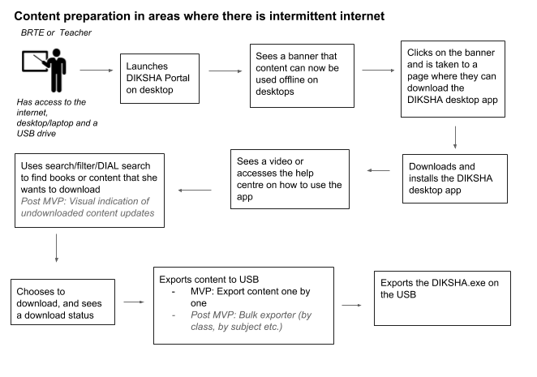
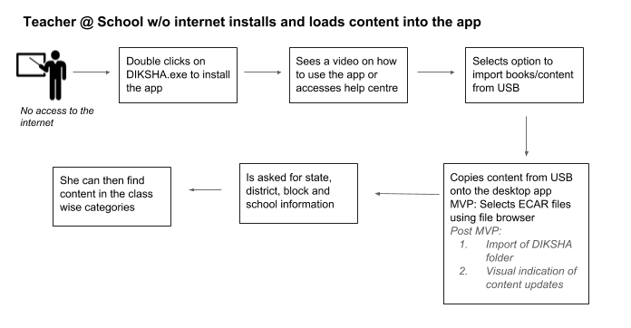
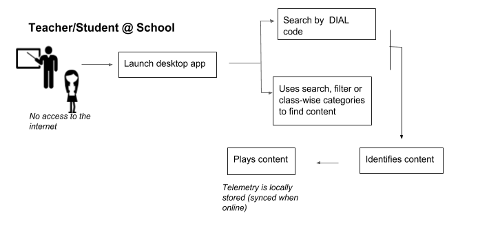
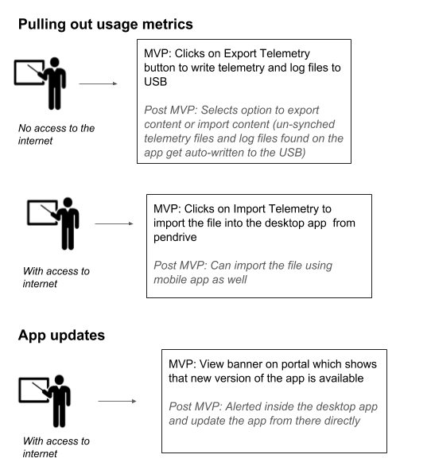

# Offline-desktop-consumption-(June-MVP)

**Introduction** A picture of todays reality:

\~ 70 % of schools do not have internet connection in any form

\~ 60% of schools have at least one processing device (highest being desktops)

\~ 30% of schools have projectors/TV screens

When teachers need to use content in the classrooms and labs to teach concepts and to allow students to practice, they find that the current product is limiting. This is because

1. The mobile app is optimised for offline usage but the teacher cannot use it in class because she is constrained by the screen real-estate
2. The web portal today is optimised for desktop usage, but it works in purely an online scenario

Hence, there is a need on the ground to enable consumption of ETB content on a desktop which is purely offline.

**Jobs To Be Done:** Teachers find teaching in classrooms using their mobile phone to be ineffective considering the strength of the classroom and the size of the device. They need to be able to use larger screen sizes in a purely offline set up (as most schools are in today). In order to circumvent this, they download mp4 files from the portal or from youtube and move it to the laptop (via USB or ShareIt), which they connect to the projector and display it in class. This limits the kind of content they can use, and limits the ability to capture telemetry data to do usage analysis.

* **System or Environment:**

**Process Workflow** 

**Key Assumptions**

* Only library consumption workflows need to be enabled offline. Course consumption, guest profiles and assessments are out of scope of the MVP.
* This solution is targeting teachers/BRTEs who have access to internet on a desktop outside of the school environment as a lever to get content to schools which need to access content offline on desktops.&#x20;
* The solution supports only standalone desktops with a windows configuration. It doesn’t support client-server setups and offline linux setups off the bat.

**Wireframes** [https://projects.invisionapp.com/d/#/console/17173279/355972349/comments](https://projects.invisionapp.com/d/#/console/17173279/355972349/comments)

**User Story 1 - Teacher discovers that there is a desktop app online System JIRA2207a759-5bc8-39c5-9cd2-aa9ccc1f65ddSB-11402** **Functional requirements**

* When the user is on the desktop version of the portal, he/she should see a prominent banner on the page which says that content can now be played offline on a desktop by downloading the app.
* This banner should be configured such that it can only be turned for a particular channel. By default, it should be turned OFF for all channels.
* On selection, the user is then taken to a page where they can download the desktop app. The page will also contain some instructions on what the user needs to do with the desktop app.
* This page will host the latest version of the desktop app at any given point of time. &#x20;

**Future requirements**

* This page will also host the linux installer in the future.
* Depending on the OS that the user is coming from, the right installer should be recommended first.
* State based versions of desktop apps with preferences bundled in.

**User Story 2 - Teacher installs app, downloads the content (where she has internet) System JIRA2207a759-5bc8-39c5-9cd2-aa9ccc1f65ddSB-10819** **Functional requirements**

* When a teacher plugs in the USB, and double clicks on the installer - the Desktop App gets installed on the users desktop/laptop provided the necessary configurations are met. In the event that it doesn’t meet, an error message should be shown to her (for eg, the user is trying to run the installer on a Linux machine or there isn’t enough space).
* Once the app boots up, she is shown the interface with a video on how to use the desktop app. She can refer to this video at any point of time again.&#x20;
* If she is online, she can search for content from SunbirdEd using the filters, search and DIAL search. If she is offline, she is only shown content from her local storage. She is shown a visual distinction between content that is on her local system, and content that is available online.
* Post this, she can download any type of library content (either books or individual content). She is not allowed to download courses. Once she downloads content, it is available for her to play offline anytime.&#x20;
* When she downloads content, she is shown a download queue which reflects the status of the download. She can choose to cancel a download mid-way.&#x20;
* She is also shown a popup to enter State, Block, District and School information for that instance of the desktop app. She can dismiss the popup, but it should popup everytime she launches the app till she fills in the information.
* Telemetry events should be generated for the download of content so that analysis can be done&#x20;

**Alternate scenarios**

* If the internet is disconnected mid way, the next time she is online and the app is opened - she is shown that the download continues from where it started off.

**Assumptions**

* The portal can function on all browsers and hence the user needn’t be forced to download a specific browser.

**Technical Requirements**

* The offline app will have upgrades from time to time. Graceful upgrade (major and minor versions) should be handled without deleting the working directory (i.e. all content downloaded by the user).&#x20;

**Localisation requirements**

* All pages in this workflow (except the installer) should be localised.

**User Story 3 - Teacher exports downloaded content and the app to USB System JIRA2207a759-5bc8-39c5-9cd2-aa9ccc1f65ddSB-11402** **Functional requirements**

* A teacher can choose the option to export content to USB on each of the content cards.
* When she selects the option, she is shown a categorised list of offline content (by class) and she can choose whether she exports all of the content or a selected few to the USB. She can export content one by one to the USB drive.&#x20;
* She is also given an option to export the app itself to the USB - she can choose not to allow the export.&#x20;
* On selecting the export option, the file browser of the teacher's computer opens up. She has to explicitly choose where to export the content to.&#x20;
* On selecting the content she’d like to export, she sees a progress bar that content is getting written to the USB.
* If she checks the USB, she can see all exported content is listed under a specific folder on the USB.&#x20;

**Assumptions**

* The content is available as .ecar files, so a user can also use the same USB and move the content to the mobile phone if he/she would like to. &#x20;

**Future requirements**

* The content and the desktop app will be downloadable using the mobile app as well, and can be exported to the USB directly from there.

**Localisation requirements**

* All pages in this workflow should be localised.

**User Story 4 - Teacher imports and plays content using the offline desktop app System JIRA2207a759-5bc8-39c5-9cd2-aa9ccc1f65ddSB-6739**

**Functional requirements**

* When the teacher installs the app, she is given an option to import content from USB.
* On selecting that, all the .ecar content that is on the USB is auto-transferred to the desktop app. She is shown a progress bar to indicate progress.
* Once the transfer is complete, she is shown all the content listed under class-wise page categories.
* She can select a textbook and navigate through it from the page categories and view other content through the 'View All' option.
* She can use search and filter capabilities offline as well.
  * For search, she can search on a limited set of attributes (title, description, board, medium, class, subject, keywords and concepts).
  * For filters, she can use Board, Medium, Class, Subjects and Content Type.&#x20;
* She can also use DIAL search to find the content piece linked with the DIAL code.
* She should be able to play all types of content offline except for youtube videos. When she tries to play a youtube content, she should be alerted that she needs to be online to use this content.

**Alternate Scenarios**

* If the textbook or content is already present on the desktop app, and the user tries to import the content - the newly imported content should replace the older content. (In future, this will evolve to maintain the latest version of the textbook/content without importing the older one).&#x20;
* If an individual content (which is part of a textbook) is imported already and then the textbook is imported, the older content piece should be linked into the imported textbook.&#x20;

**Telemetry requirements**

* All user actions need to generate telemetry events, with the state/district/block/school stamped if the user has filled it in. The telemetry should be stored locally to allow for export.
* Telemetry data should auto sync every minute if there is connectivity to the internet.

**Future requirements**

* The content listing page will be textbook led, to match the new mobile app experience.

**Localisation requirements**

* All pages in this workflow should be localised.

**User Story 5 - Offline import/export of telemetry System JIRA2207a759-5bc8-39c5-9cd2-aa9ccc1f65ddSB-11403** **Functional requirements**

* A user is provided an option in Settings to access telemetry data. He/she can select whether or not they want telemetry to be synched to the server. By default, this is set to auto-sync. The auto-sync of telemetry should be attempted once every 2 mins, given the nature of intermittent connectivity.&#x20;
* When a user decides to export the telemetry, it should be written to the USB as a separate encrypted file. The user has an explicit option to import the telemetry files into the desktop app from a USB if they have a file from another app. There should be a listing provided of all previously imported files with a timestamp so a user can identify that they have imported the file.&#x20;
* The user should also be able to open the telemetry file using the SunbirdEd mobile app in order to synch it.
* The user should also be able to import a telemetry file into the desktop app which can be synced when that desktop is online.

**Technical requirements**

* The telemetry shouldn’t be deleted from the system - as the user maynot follow up and synch it online. There should be a policy to archive telemetry and re-synch it if needed.

**User Story 6 - Allow teachers to play content online using the desktop app System JIRA2207a759-5bc8-39c5-9cd2-aa9ccc1f65ddSB-12221** **Functional requirements**

* When a user is browsing the desktop app, and finds a book, collection or individual content - she can proceed to navigate through the book all the way to the individual content to play the content.&#x20;
* The user will be provided an option to download the book from the TOC page, or the individual content from the page on which the content plays. This is in addition to the download icon present on the content cards themselves.
* The user will not be allowed to download individual textbookunits.&#x20;

**Technical requirements**

* Telemetry events should be raised for all the download actions initiated by the user.&#x20;

**Key Metrics** The below reports will be monitored for the solution:

* Funnels for offline desktop content consumption (DIAL search/explore+view all, content click, navigate TOC, play content)
* Time spent on offline desktop app (content play time, upload time, download time, navigation time)
* No. of devices going to the download desktop app page from portal.
* No. of devices downloading the desktop app.
* No. of devices downloading content using the desktop app (split up between textbook download and content download)
* No. of devices using Export books/content and Import books/content features (funnels for both these flows to see if there are drop-offs)
* No. of devices using Settings and Import Telemetry
* State based split up of content consumption

**Non-functional requirements**

* Download of content should work on a 1Mbps line, with intermittent connectivity.
* Textbook size for downloads 1 GB to 5GB

***

\[\[category.storage-team]] \[\[category.confluence]]
